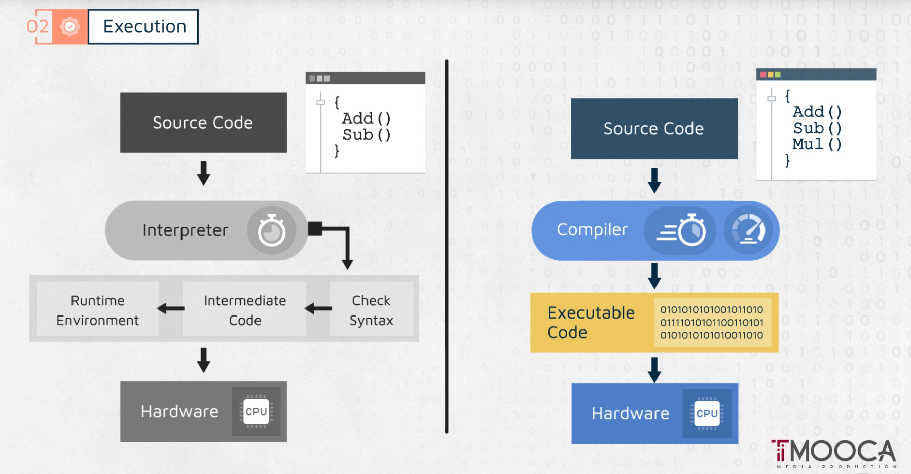
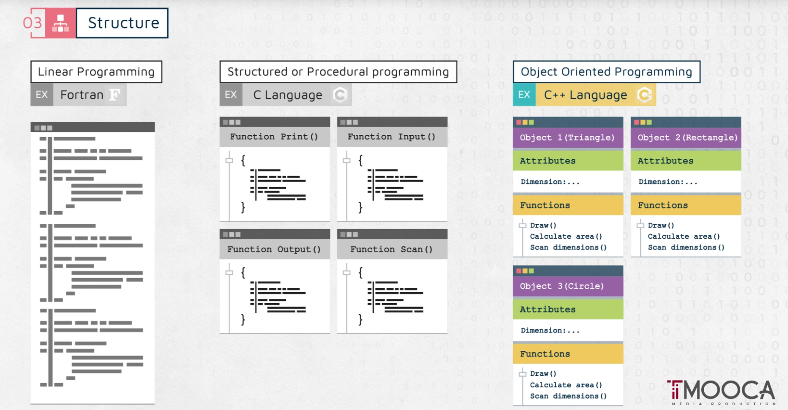
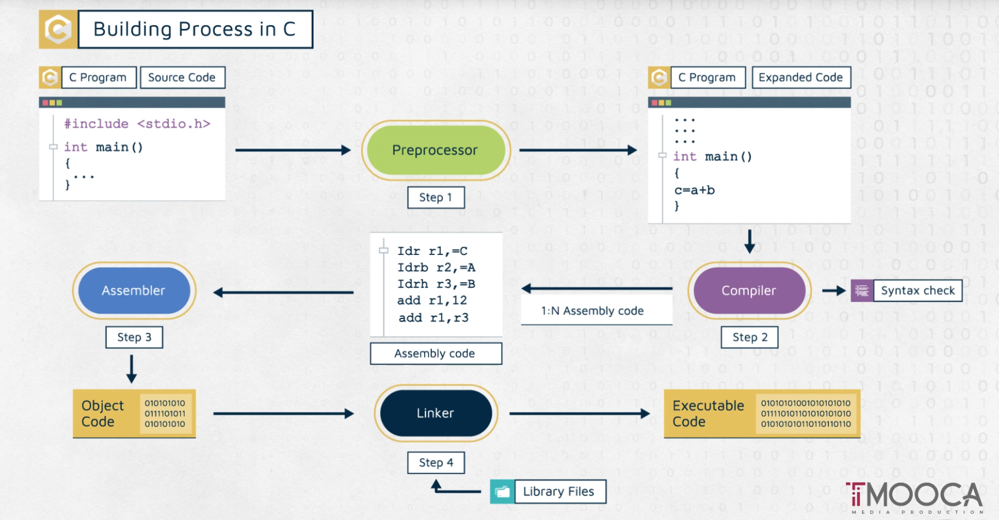
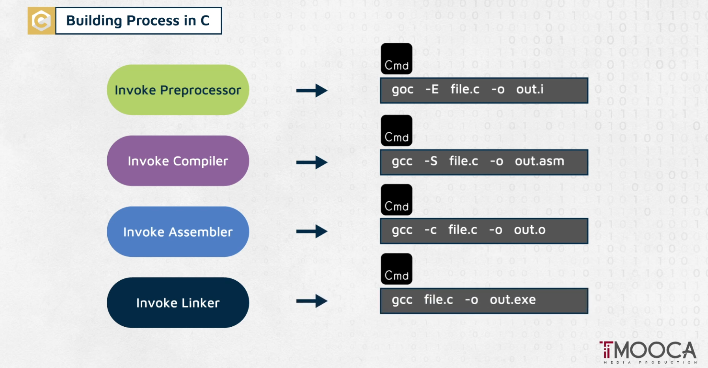
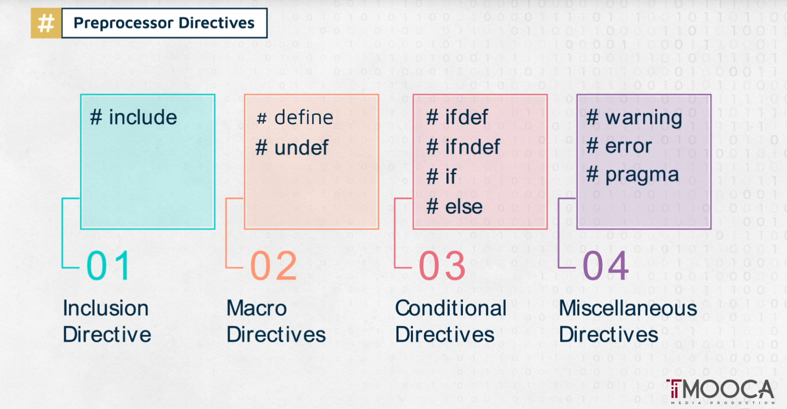
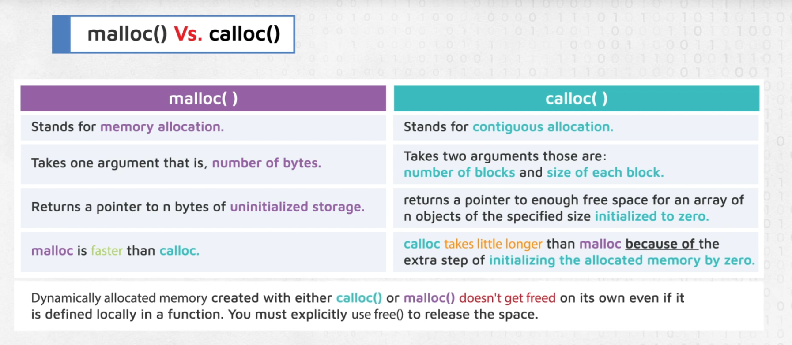

# Basics of C++

## C/C++ Build Process: 4 Steps

### 1. **Preprocessing**
The preprocessor handles directives starting with `#` (like `#include`, `#define`, `#pragma`). It expands macros, includes header files, and removes comments. The output is pure C/C++ code with all preprocessing completed, saved as `.i` files.

### 2. **Compilation**
The compiler translates the preprocessed code into assembly language specific to the target architecture. It performs syntax checking, optimization, and generates human-readable assembly code (`.s` files).

### 3. **Assembly**
The assembler converts assembly code into machine code, producing object files (`.o` or `.obj`). These contain binary instructions but with unresolved references to external functions and variables.

### 4. **Linking**
The linker combines multiple object files and resolves external references by connecting function calls to their definitions. It links against libraries (static `.a`/`.lib` or dynamic `.so`/`.dll`) and produces the final executable or library file.