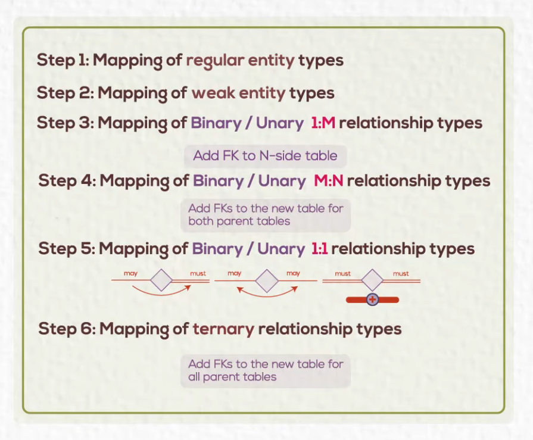

# Database Basics

## Introduction

### Limitations of File Based System

- Separation & Isolation of data
- Duplication of data
- Program Data dependence
- Incompatible file format

### Terminologies

> Database -> A collection of related data

> DBMS (Data Base Management System) -> A software package /system to facilitate the creation and mgmt of a database

> Database System -> DBMS + data

### DBMS Components

DB Metadata:
- Table name
- Column name
- Column Data type
- Constraints
- Access Privileges
- Username
- Password
- User's Privileges
- DB objects structure
- Log files

Sored DB: data itself

### Advantages of DBMS

- Controlling redundancy: data written once, and several users can access it
- Restricting Access: we create the users and give specific access
- Enforcing integrity constraints
- Providing backup and recovery

### DB Users

- **System Analyst**: analyses and gathers requirements
- **Database Designer**: creates database design (conceptual schema)
- **Database Administrator (DBA)**: Install DBMS, create DB schema and populate data, create users and their authorization, maintain DB performance
- **Application Programmer**: develop, test, debug app
- **End user**

### DBMS Architecture (Three-Schema Architecture)

1. External Schema (View level)
    - Defines what each user or group can access and how data is displayed.
    - Multiple external schemas exist for different users or applications.
2. Conceptual Schema (Logical level)
    - Defines what data is stored and the relationships between data.
    - Describes database structure — entities, attributes, and constraints.
3. Physical Schema (Internal level)
    - Defines how data is physically stored on disk.
    - Handles storage allocation, indexing, and access paths.

#### Mappings

- **External ↔ Conceptual Mapping:** Translates user views into the logical structure of the database.
- **Conceptual ↔ Physical Mapping:** Translates the logical design into physical storage structures.

### Data Models

1. Logical/Conceptual Model
    - Represents the structure of data and relationships independent of physical storage.
    - Example: Entity Relationship Diagram (ERD)

2. Physical Model
    - Represents how data is actually stored and accessed in the database.
    - Example: Table structures, indexes, partitions, storage paths

### Other Functions of a DBMS

Modern DBMSs provide more than just basic data storage and retrieval. They support advanced data types and operations for diverse applications:

- Spatial Data Management:
    - Handles geographical and geometric data (maps, coordinates, regions).
    - Supports queries like distance, area, and spatial relationships.
- Time-Series Data Management:
    - Manages data that changes over time (sensor readings, stock prices, logs).
    - Optimized for time-based queries, trends, and historical analysis.
- Multimedia Data Management:
    - Stores and retrieves images, audio, video, and documents.
    - Supports metadata indexing, compression, and content-based search
- Data Mining and Analytics:
    - Integrates data analysis and pattern discovery functions.
    - Enables clustering, classification, and prediction within the DBMS.

### Database Environment

#### Centralized Database Environment

All data is stored and managed on a **single central server**. This setup is simpler but has limited scalability and fault tolerance.

1. Mainframe Environment
    - All processing is handled by **one central server**.
    - Performance is **slow** due to the heavy load on a single machine.
    - **Single point of failure**: if the server fails, both the application and database become unavailable.
2. Client/Server Environment
    - **Thick client**: the application is installed locally on user machines, while the database is hosted on a central server.
    - Database server remains a single point of failure — if it fails, all clients lose access.
    - Application layer is distributed, so it’s not a single point of failure.
    - High support and maintenance cost due to managing many client installations.
3. Internet Computing Environment (Three-tier architecture)
    - Consists of three layers:
        - Database Server
        - Application Server
        - Thin Client (Web Browser)
    - Application Server handles the logic and can become a single point of failure if only one is used.
    - Lower cost for maintenance and support (clients only need a browser).
    - Three-tier: one application server.
    - N-tier: multiple application servers for load balancing and fault tolerance.
    - If one application server fails, users can be redirected to another running server.
    - The database is still a single point of failure unless replicated.

#### Distributed Database Environment

Data is stored across **multiple interconnected databases** on different machines or locations.

- Provides high availability and fault tolerance; database is no longer a single point of failure.
- Can be homogeneous (same DBMS vendor) or heterogeneous (different vendors).
- High setup and licensing cost, but much better reliability and scalability.

    1. Database Replication
        - Data is copied (partially or fully) across multiple databases.
        - Ensures data redundancy and faster local access.

    2. Database Fragmentation
        - Data is divided into fragments and distributed across different databases.
        - Can be:
            - Horizontal fragmentation: divides rows.
            - Vertical fragmentation: divides columns.
            - Hybrid fragmentation: mix of both.
        - All fragments remain logically connected and accessible as a single database.

## Entity Relationship Diagram

### Core Concepts

- **Data Model**: a conceptual representation of how data is structured and related within a system.
- **Entity**: something in the real world with an **independent existence**. Could be physical or conceptual. can be described with attributes or characteristics.
- **Attribute**: particular properties that describe the entity.
- **Relationship**: an association between two or more entities (e.g., Employee works in Department).

### Steps to build a data model

1. What entities need to be described in the model?
2. What attributes of these entities need to be recorded?
3. Can an attribute or set of attributes uniquely identify one specific occurence of an entity?
4. What relationships exist between entities?

### Entity Types

1. Strong Entity
    - Exists independently of other entities.
    - Has a primary key that uniquely identifies it.
2. Weak Entity (Doubled Rectangle)
    - Depends on a strong entity for its existence.
    - Identified by a partial key combined with the key of the related strong entity.

### Attribute Types

- Simple Attribute: Cannot be divided further (Name).
- Composite Attribute: Can be divided into smaller parts (FullName → FirstName, LastName).
- Derived Attribute: Value can be derived from another (Age from DateOfBirth).
- Multivalued Attribute: Can have multiple values (PhoneNumbers).

### Key Types

1. Candidate Key: Attribute(s) that can uniquely identify an entity.
2. Primary Key: The chosen candidate key used for identification.
3. Foreign Key: Attribute that refers to a primary key in another entity to represent a relationship.

### Relations

> A connection bewteen entity classes

Each relationship needs:

1. Degree of relationship: Number of entities participating in this relationship
    - Unary (1 Entity): e.g., an Employee supervises another Employee.
    - Binary (2 Entities): e.g., an Employee works in a Department.
    - Ternary (3 Entities): e.g., an Employee uses Skills in a Project.
2. Cardinality Ratio: Maximum number of relationships
    - 1:1 (One-to-One)
    - 1:N (One-to-Many)
    - N:1 (Many-to-One)
    - M:N (Many-to-Many)
    - In a ternary relationship, if cardinalities differ, it’s usually better to split into multiple binary relationships.
3. Participation: Minimum number of relationships
    - Total (Must Participate): shown with double lines.
    - Partial (May Participate): shown with single lines.

## Mapping to Tables

> After designing an ERD, the next step is to **convert (map)** it into a **relational schema**, a set of database tables with relationships represented using keys.

### **1. Strong Entity → Table**
- Each **strong entity** becomes a **table**.  
- **Attributes** become table columns.  
- The **primary key** of the entity becomes the **primary key** of the table.  

**Example:**  
Entity: `Student (StudentID, Name, Email)`  
→  
Table:  `STUDENT(StudentID [PK], Name, Email)`

### **2. Weak Entity → Table**
- Each **weak entity** also becomes a table.  
- Include a **foreign key** from its **owner entity** (the strong one).  
- The **primary key** is the combination of the **partial key + owner’s primary key**.  

**Example:**  
Weak Entity: `Dependent (DepName)` depends on `Employee (EmpID)`  
→  
Table:  `DEPENDENT(EmpID [FK], DepName, PRIMARY KEY (EmpID, DepName))`

### **3. Attributes → Columns**
- **Simple attributes:** become individual columns.  
- **Composite attributes:** split into separate columns.  
  - e.g., `Name → FirstName, LastName`  
- **Multivalued attributes:** require a **separate table** with a foreign key reference.  
  - e.g., `Student_Phone(StudentID [FK], PhoneNumber)`  
- **Derived attributes:** usually **not stored**, since they can be computed.

### **4. Relationships → Foreign Keys or New Tables**

#### **a. One-to-One (1:1)**  
- Add the **primary key of one entity** as a **foreign key** in the other.  
- Choose the side that makes logical sense or has total participation.  

#### **b. One-to-Many (1:N)**  
- Add the **primary key** of the “one” side as a **foreign key** in the “many” side.  

**Example:**  
`Department (DeptID)` —< `Employee (EmpID, DeptID [FK])`  

#### **c. Many-to-Many (M:N)**  
- Create a **new table (intersection/junction table)**.  
- Include **foreign keys** from both entities, and optionally other relationship attributes.  

**Example:**  
`Student` —< `Enrollment` >— `Course`  
ENROLLMENT(StudentID [FK], CourseID [FK], Grade)
PRIMARY KEY (StudentID, CourseID)

**d. Ternary Relationships**  
- Create a **new table** with foreign keys from all three entities.  

**Example:**  
ASSIGNMENT(EmployeeID [FK], ProjectID [FK], SkillID [FK])

### **5. Specialization / Generalization (Optional)**
For **inheritance hierarchies**, common mapping approaches include:

1. **Single Table:** One table for all entities (add a type attribute).  
2. **Class Table:** One table per subclass with a foreign key to the superclass.  
3. **Separate Tables:** Each subclass has its own table with duplicated shared fields.

### **Summary**

| ERD Element | Mapping in Tables |
|--------------|-------------------|
| Strong Entity | Table with attributes and PK |
| Weak Entity | Table + FK to owner + composite PK |
| Simple Attribute | Column |
| Composite Attribute | Split into multiple columns |
| Multivalued Attribute | Separate table |
| Derived Attribute | Not stored |
| 1:1 Relationship | FK in one table |
| 1:N Relationship | FK in “many” side |
| M:N Relationship | New intersection table |
| Ternary Relationship | New table with 3 FKs |

#### **How ERD, SQL, and Tables Match the Three-Schema Architecture**

| Concept / Artifact | Schema Level | Data Model Type | Description |
|--------------------|---------------|------------------|--------------|
| **ERD (Entity Relationship Diagram)** | **Conceptual Schema** | **Logical / Conceptual Model** | Represents *what data exists* and *how entities relate*. No details on how it’s stored. |
| **SQL DDL (CREATE TABLE, ALTER TABLE, etc.)** | **Physical Schema** | **Physical Model** | Defines *how data is implemented* in the database — table structures, data types, indexes, and constraints. |
| **Database Tables (actual stored data)** | **Physical Schema** | **Physical Model** | The *real physical storage* of data in files or pages on disk, managed by the DBMS. |
| **Views (SQL VIEW)** | **External Schema** | — | Defines *what part of the data a user or application sees* and *how it is presented*. |

## Top DBMS Comparison

| DBMS | Type | Best For | Why Choose It | Important Notes |
|------|------|-----------|----------------|-----------------|
| **MySQL** | Open Source (Free) | Web apps, CMS, e-commerce | Fast, reliable, widely supported | Owned by Oracle, limited advanced SQL features |
| **PostgreSQL** | Open Source (Free) | Complex apps, analytics, finance | Strong ACID compliance, supports JSON, very extensible | Slightly slower writes than MySQL |
| **SQLite** | Open Source (Free) | Mobile, desktop, testing | Serverless, lightweight, zero setup | Not for high-concurrency or distributed systems |
| **MariaDB** | Open Source (Free) | MySQL-compatible apps | Faster replication, community-driven | Fully compatible with MySQL, better open governance |
| **Cassandra** | Open Source (Free) | IoT, logs, large-scale distributed data | Handles huge writes, no single point of failure | Complex setup, limited ad-hoc querying |
| **Redis** | Open Source (Free) | Caching, real-time data, messaging | Extremely fast (in-memory), supports pub/sub | Data lost on crash unless persistence enabled |
| **MongoDB** | Open Source (Community), Enterprise option | NoSQL, flexible data, modern apps | Schema-less, easy scaling, JSON-like docs | Transactions weaker than SQL; BSON storage overhead |
| **Microsoft SQL Server** | Commercial (Enterprise + Free Express) | Enterprise apps, Windows-based systems | Tight Windows/.NET integration, strong BI tools | Best performance on Windows, not ideal for Linux |
| **Neo4j** | Open Source (Community) + Enterprise | Graphs, relationships, social networks | Powerful graph queries (Cypher), fast relationship traversal | Memory-intensive, not ideal for tabular data |
| **Oracle DB** | Commercial (Enterprise) | Banking, ERP, large corporations | Extremely reliable, secure, advanced features | Expensive, complex licensing |

### Why So Many DBMS?
Different **data models**, **performance goals**, and **scalability needs**.  
No single DBMS fits all — each trades off between **consistency**, **availability**, and **speed** (CAP theorem).

---

### Choosing a DBMS
| Need | Use |
|------|-----|
| Structured data, transactions | MySQL / PostgreSQL / Oracle |
| Unstructured or evolving data | MongoDB / Cassandra |
| High-speed cache or ephemeral data | Redis |
| Local or small-scale app | SQLite |
| Complex relationships | Neo4j |

## Single Point of Failure (SPOF)

- A **Single Point of Failure (SPOF)** is any part of a system that, if it fails, causes the entire system or service to stop working.
- If **one component** breaks → **everything stops**.
- Example:  
    - You have **one database server**.  
    - If it crashes, your app can’t access data.  
    - That server is a **single point of failure**.

### In Databases
| Type | Example | Effect of Failure |
|------|----------|------------------|
| Centralized | MySQL with one server | System goes down |
| Distributed | Cassandra, MongoDB Cluster | Other nodes take over, system stays online |

### Why Avoid It
- Increases **downtime risk**  
- Makes system **less reliable**  
- Harder to scale safely  

### How to Prevent It
- Use **replication** (multiple DB copies)  
- Use **load balancers**  
- Deploy **redundant servers** in different zones  
- Regular **backups**

## DBMS System Structure and Architecture

### DBMS System Structure
A **Database Management System (DBMS)** is software that manages how data is stored, retrieved, and updated.  
It provides an interface between the user, the application, and the physical data on storage.

#### Main Components
| Component | Function |
|------------|-----------|
| **Query Processor** | Converts SQL queries into low-level database operations. |
| **Storage Manager** | Controls how data is physically stored and retrieved from disk. |
| **Buffer Manager** | Manages data movement between disk and main memory (RAM). |
| **Transaction Manager** | Ensures ACID properties (Atomicity, Consistency, Isolation, Durability). |
| **Metadata Manager** | Handles data about data (schemas, constraints, users). |
| **File Manager** | Manages files, disk space, and physical data organization. |
| **Authorization & Integrity Manager** | Enforces security, access rights, and data validation rules. |

**Purpose:**  
These components work together to make sure queries are executed efficiently, data is safe from corruption, and transactions are consistent.

### DBMS Architecture
The **architecture** defines how the DBMS components and users interact through layers.

#### 1. One-Tier Architecture
- User directly interacts with the database system.  
- Example: Using SQLite locally on a personal machine.

**Pros:** Simple to set up  
**Cons:** Not secure or scalable

#### 2. Two-Tier Architecture
- The application communicates directly with the database.  
- Common in small client-server systems.

**Flow:**  
Client Application ↔ Database Server

**Pros:** Fast communication  
**Cons:** Difficult to manage large numbers of clients, limited scalability

#### 3. Three-Tier Architecture
- Adds a middle **application server** layer between the user interface and the database.

**Flow:**  
Client (UI) → Application Server → Database Server

**Pros:**  
- Scalable and secure  
- Business logic is separated from data logic  
- Easier to maintain and extend

**Cons:**  
- More complex setup and slightly higher latency

### Logical View of Architecture (Data Abstraction Levels)
| Level | Description |
|--------|--------------|
| **External Level** | Defines how each user views the data (user-specific views). |
| **Conceptual Level** | Describes the logical structure of the entire database. |
| **Internal Level** | Deals with physical storage and data organization on disk. |

**Purpose:**  
Data abstraction hides physical details from the user, improving simplicity and flexibility.

### Summary
- **System Structure** = Internal components and their roles.  
- **Architecture** = How layers and users interact with the DBMS.  
- Together, they make the DBMS efficient, secure, and maintainable.

## Data Warehouse and Big Data

### Data Warehouse
A **Data Warehouse (DW)** is a **centralized repository** that stores large volumes of **structured, historical data** from multiple sources.  
It is designed mainly for **analysis and reporting**, not for day-to-day transactions.

#### Key Features
| Feature | Description |
|----------|-------------|
| **Subject-Oriented** | Organized around business subjects (sales, customers, etc.) |
| **Integrated** | Collects data from many sources (databases, logs, ERP, CRM) |
| **Time-Variant** | Stores historical data for trend analysis |
| **Non-Volatile** | Data is stable; once entered, rarely updated or deleted |

#### Data Flow
Operational Databases → ETL (Extract, Transform, Load) → Data Warehouse → BI Tools (Reports, Dashboards)

#### Why Use It
- Supports **business intelligence (BI)** and **decision making**  
- Provides **consistent, clean, and historical** data view  
- Allows **complex queries** and **aggregations** efficiently

#### Examples
- Amazon Redshift  
- Google BigQuery  
- Snowflake  
- Microsoft Azure Synapse  
- Teradata

---

### Big Data
**Big Data** refers to **massive, fast, and diverse datasets** that traditional databases cannot handle efficiently.

#### The 5 V’s of Big Data
| V | Meaning |
|---|----------|
| **Volume** | Huge amounts of data (TBs, PBs, ZBs) |
| **Velocity** | High speed of data generation (real-time streams) |
| **Variety** | Structured, semi-structured, and unstructured data |
| **Veracity** | Inconsistent, uncertain, or incomplete data |
| **Value** | Extracting meaningful insights and patterns |

#### Big Data Technologies
| Category | Examples |
|-----------|-----------|
| **Storage** | HDFS (Hadoop Distributed File System) |
| **Processing** | Apache Spark, Hadoop MapReduce |
| **NoSQL Databases** | MongoDB, Cassandra, HBase |
| **Streaming** | Apache Kafka, Flink |
| **Visualization** | Tableau, Power BI |

---

### Comparison

| Aspect | Data Warehouse | Big Data |
|--------|----------------|----------|
| **Data Type** | Structured | Structured + Unstructured |
| **Purpose** | Historical analysis, BI | Real-time analytics, prediction |
| **Data Volume** | Large (but finite) | Massive, often continuous |
| **Processing** | SQL-based (Batch) | Distributed, parallel (MapReduce, Spark) |
| **Technology** | OLAP systems | NoSQL, Hadoop, Spark ecosystems |
| **Users** | Business analysts | Data scientists, engineers |

---

### Integration
In modern systems, both coexist:
- **Big Data** platforms collect, clean, and process large raw data.  
- **Data Warehouse** stores refined, structured data for business analysis.

---

### Summary
- **Data Warehouse** = Organized, structured, historical data for analysis.  
- **Big Data** = Enormous, fast, and diverse data for large-scale processing and insights.  
Both aim to **turn data into knowledge**, but differ in **data type, purpose, and tools**.

## Types of NoSQL Databases

NoSQL databases are **non-relational** and handle **unstructured or semi-structured** data.  
They are built for **scalability, flexibility, and high performance**.

### 1. Key-Value Stores
- **Structure:** Data stored as key–value pairs.  
- **Best for:** Caching, session management, real-time data.  
- **Examples:** Redis, Amazon DynamoDB, Riak  
- **Why:** Fast lookups using unique keys.

### 2. Document Stores
- **Structure:** Data stored as documents (usually JSON/BSON).  
- **Best for:** Content management, catalogs, user profiles.  
- **Examples:** MongoDB, CouchDB  
- **Why:** Flexible schema, easy to store nested data.

### 3. Column-Family Stores
- **Structure:** Data stored in columns and column families, not rows.  
- **Best for:** Large analytical datasets, time-series data.  
- **Examples:** Apache Cassandra, HBase  
- **Why:** Efficient for queries on specific columns; scalable for big data.

### 4. Graph Databases
- **Structure:** Nodes (entities) and edges (relationships).  
- **Best for:** Social networks, recommendation systems, fraud detection.  
- **Examples:** Neo4j, Amazon Neptune  
- **Why:** Optimized for relationship-based queries.

### Summary Table
| Type | Data Model | Best For | Examples |
|------|-------------|----------|-----------|
| Key-Value | Key–Value pairs | Caching, quick lookups | Redis, DynamoDB |
| Document | JSON-like documents | Flexible data, apps with varied structures | MongoDB, CouchDB |
| Column-Family | Columns grouped by family | Big data, analytics | Cassandra, HBase |
| Graph | Nodes and relationships | Connected data | Neo4j, Amazon Neptune |
