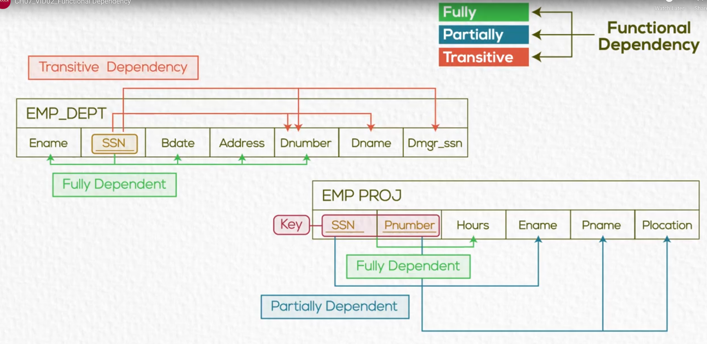
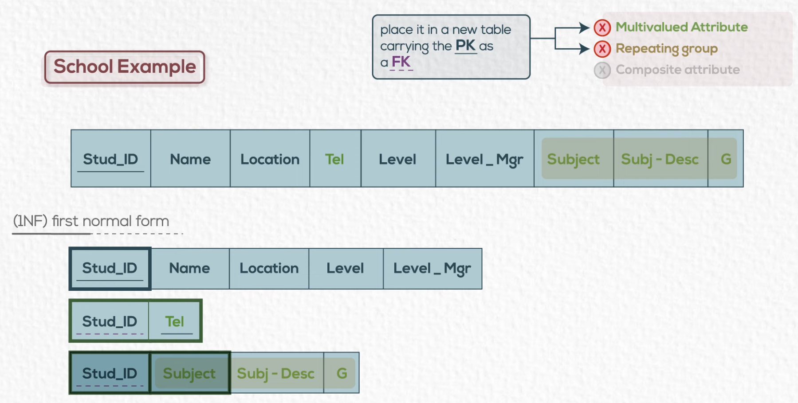
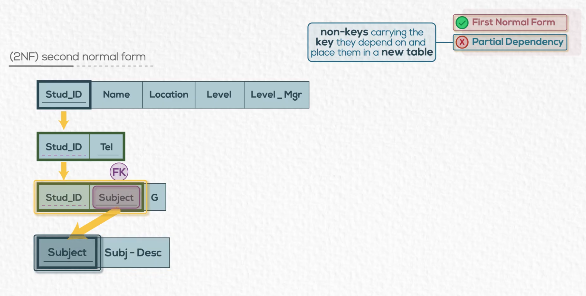
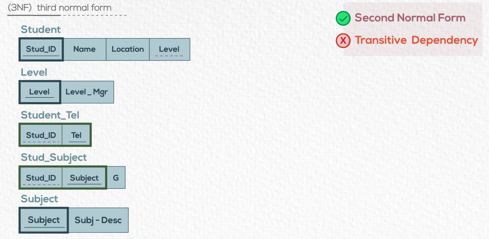
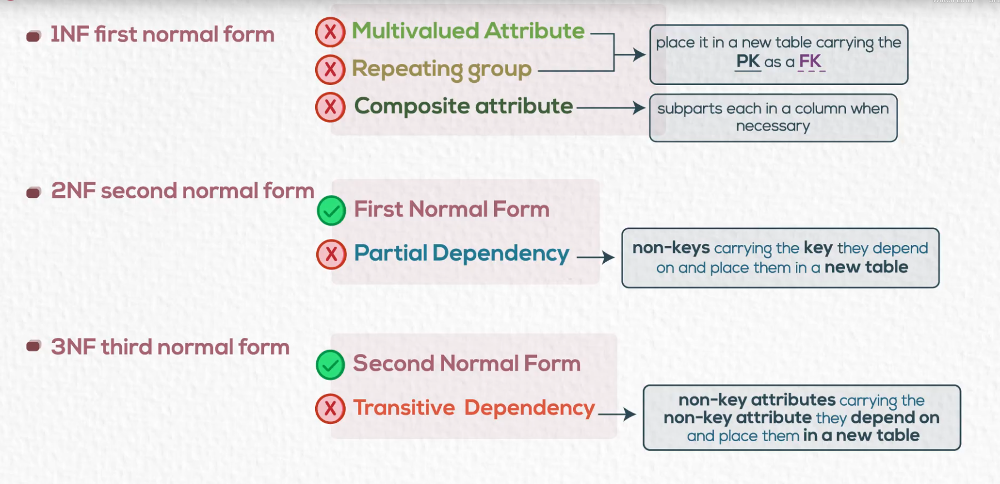

# **SQL**

> **Structured Query Language** — used to define, manipulate, and query data in a database.

---

### **Database Schema**
- A **schema** is a logical group of related database objects (tables, views, indexes, etc.).  
- Each schema has **one owner**, who can manage and modify the objects within it.

---

### **Data Types**
- Determine the **kind of data** that can be stored in a column.  
- Common types:
  - **Alphanumeric:** `CHAR`, `VARCHAR`
  - **Numeric:** `INT`, `FLOAT`, `DECIMAL`
  - **Date/Time:** `DATE`, `TIME`, `TIMESTAMP`
  - **Character:** `CHAR`, `TEXT`
  - **Boolean:** `TRUE` / `FALSE`

---

### **Database Constraints**
Used to **enforce data integrity** and maintain valid data within the database.

| Constraint | Description |
|-------------|-------------|
| **PRIMARY KEY** | Uniquely identifies each record in a table |
| **FOREIGN KEY** | Ensures referential integrity between tables |
| **UNIQUE** | Prevents duplicate values in a column |
| **NOT NULL** | Ensures a column cannot have `NULL` values |
| **CHECK** | Ensures that data meets a specific condition |
| **DEFAULT** | Assigns a default value if none is provided |

---

## **Types of SQL**

### **1. Data Definition Language (DDL)**
Used to **define and modify** database structures.  
> DDL commands are *auto-committed* — they **cannot be rolled back**.

```sql
-- Create a new table
CREATE TABLE tablename (
    columnName dataType constraint,
    ...
);

-- Add a column
ALTER TABLE tablename ADD columnName dataType constraint;

-- Drop a column
ALTER TABLE tablename DROP COLUMN columnName;

-- Delete a table
DROP TABLE tablename;

-- Remove all data but keep structure
TRUNCATE TABLE tablename;  -- Cannot be rolled back
```

### **2. Data Manipulation Language (DML)**

Used to insert, update, delete, and retrieve data.

> DML operations can be rolled back before a commit.

```sql
-- Insert new record(s)
INSERT INTO tablename (column1, column2, ...)
VALUES (value1, value2, ...);

-- Insert without specifying columns (must match order)
INSERT INTO tablename VALUES (value1, value2, ...);

-- Update record(s)
UPDATE tablename
SET column1 = value1, column2 = value2
WHERE condition;

-- Delete record(s)
DELETE FROM tablename
WHERE condition;  -- Can be rolled back

-- Retrieve data
SELECT column1, column2
FROM tablename
WHERE condition;
```
### **3. Data Control Language (DCL)**

Used to control access and permissions for users.

```sql
-- Grant privileges
GRANT SELECT ON TABLE tablename TO username;
GRANT ALL ON TABLE tablename TO username1, username2;
GRANT SELECT ON TABLE tablename TO username WITH GRANT OPTION;

-- Revoke privileges
REVOKE UPDATE ON TABLE tablename FROM username;
REVOKE ALL ON TABLE tablename FROM username1, username2;
```

## **Comparison and Logical Operators**

SQL uses operators to compare, filter, and combine conditions in queries.

| **Type** | **Operator** | **Description** |
|-----------|---------------|-----------------|
| **Comparison** | `=`, `>`, `<`, `>=`, `<=`, `<>` | Compare numeric or string values |
| **Range** | `BETWEEN x AND y` | Checks if a value lies between two values (inclusive) |
| **Set** | `IN (x, y, z)` | Checks if a value matches any in a list |
| **Pattern Matching** | `LIKE` | Matches text patterns using `%` (any sequence) and `_` (single character) |
| **Null Check** | `IS NULL`, `IS NOT NULL` | Tests for NULL values |
| **Logical** | `AND`, `OR`, `NOT` | Combine multiple conditions |

**Example:**
```sql
SELECT *
FROM Employee
WHERE Salary BETWEEN 3000 AND 5000
  AND Department IN ('HR', 'Finance')
  AND Name LIKE 'J%n'
  AND ManagerID IS NOT NULL;
```

## Aliases

Aliases temporarily rename columns or tables for readability.

```sql
-- Column alias
SELECT Name AS EmployeeName, Salary AS MonthlySalary
FROM Employee;

-- Table alias
SELECT e.Name, d.DepartmentName
FROM Employee AS e, Department AS d
WHERE e.DeptID = d.DeptID;
```
## Sorting and Uniqueness

### Order By

Sorts query results in ascending (ASC, default) or descending (DESC) order.

```sql
SELECT Name, Salary
FROM Employee
ORDER BY Salary DESC;
```

### Distinct

Removes duplicate rows from the result set.

```sql
SELECT DISTINCT Department
FROM Employee;
```

## **Aggregate Functions**

Aggregate functions perform calculations on groups of rows.

> Aggergate functions ignore nulls

| **Function** | **Description** |
|---------------|-----------------|
| `COUNT()` | Counts rows |
| `SUM()` | Adds up values |
| `AVG()` | Returns average |
| `MAX()` | Finds maximum value |
| `MIN()` | Finds minimum value |

**Example:**
```sql
SELECT
  COUNT(*) AS TotalEmployees,
  AVG(Salary) AS AverageSalary,
  MAX(Salary) AS HighestSalary,
  MIN(Salary) AS LowestSalary
FROM Employee;
```
## **GROUP BY and HAVING**

### **GROUP BY**
Groups rows that have the same values into summary rows — often used with aggregate functions like `COUNT()`, `SUM()`, or `AVG()`.

### **HAVING**
Filters the grouped results (similar to `WHERE`, but applied *after* aggregation).

**Example:**
```sql
SELECT Department, AVG(Salary) AS AvgSalary
FROM Employee
GROUP BY Department
HAVING AVG(Salary) > 5000;
```
Note:
- ```WHERE``` filters individual rows before grouping.
- ```HAVING``` filters groups after aggregation.

## **Subqueries**

A **subquery** is a query nested inside another query.  
It can appear in the `SELECT`, `FROM`, or `WHERE` clauses to return data used by the main query.

---

### **1. Subquery in WHERE**
Used to compare a value to the result of another query.

```sql
-- Returns employees earning more than the average salary.
SELECT Name, Salary
FROM Employee
WHERE Salary > (
  SELECT AVG(Salary)
  FROM Employee
);
```

### 2. Subquery in FROM (Inline View)

Used as a **temporary table (derived table)** inside the main query.

```sql
-- Filters departments where the average salary exceeds 6000.
SELECT DeptName, AVG_Salary
FROM (
  SELECT Department AS DeptName, AVG(Salary) AS AVG_Salary
  FROM Employee
  GROUP BY Department
) AS DeptSummary
WHERE AVG_Salary > 6000;
```

### 3. Subquery in SELECT

Used to return a **calculated** or **looked-up** value for each row in the main query.

```sql
-- Displays each employee’s name and department name retrieved from another table.
SELECT Name,
       (SELECT DepartmentName
        FROM Department d
        WHERE d.DeptID = e.DeptID) AS Department
FROM Employee e;
```

## Joins

```sql
-- =====================================================
-- 🧩 SQL JOINS — Combine data from multiple tables
-- =====================================================

-- 1️⃣ INNER JOIN
-- Returns only rows that have matching values in both tables
SELECT e.Name, d.DepartmentName
FROM Employee e
INNER JOIN Department d ON e.DeptID = d.DeptID;
-- Example: shows employees and their departments only if DeptID matches in both tables


-- 2️⃣ LEFT JOIN (LEFT OUTER JOIN)
-- Returns all rows from the LEFT table, even if there’s no match in the right table
SELECT e.Name, d.DepartmentName
FROM Employee e
LEFT JOIN Department d ON e.DeptID = d.DeptID;
-- Example: includes all employees, even those without a department


-- 3️⃣ RIGHT JOIN (RIGHT OUTER JOIN)
-- Returns all rows from the RIGHT table, even if there’s no match in the left table
SELECT e.Name, d.DepartmentName
FROM Employee e
RIGHT JOIN Department d ON e.DeptID = d.DeptID;
-- Example: includes all departments, even if no employees belong to them


-- 4️⃣ FULL OUTER JOIN
-- Returns all rows when there’s a match in either table
SELECT e.Name, d.DepartmentName
FROM Employee e
FULL OUTER JOIN Department d ON e.DeptID = d.DeptID;
-- Example: shows all employees and all departments, including unmatched ones


-- 5️⃣ CROSS JOIN
-- Returns the Cartesian product (every combination of rows from both tables)
SELECT e.Name, d.DepartmentName
FROM Employee e
CROSS JOIN Department d;
-- Example: if there are 5 employees and 3 departments, result = 15 rows (5 × 3)


-- 6️⃣ SELF JOIN
-- A table joins with itself — useful for hierarchical or recursive data
SELECT e1.Name AS Employee, e2.Name AS Manager
FROM Employee e1
INNER JOIN Employee e2 ON e1.ManagerID = e2.EmpID;
-- Example: shows each employee and their manager’s name
```

## SQL Query Execution Order

| **Step** | **Clause**      | **Purpose / What Happens** |
|-----------|----------------|-----------------------------|
| 1️⃣ | `FROM` / `JOIN` | Load and join tables. Data source is prepared. |
| 2️⃣ | `WHERE` | Filter individual rows (non-aggregated). |
| 3️⃣ | `GROUP BY` | Group rows that share the same values. |
| 4️⃣ | `AGGREGATE FUNCTIONS` | Apply `SUM()`, `AVG()`, `COUNT()`, etc. to each group. |
| 5️⃣ | `HAVING` | Filter the grouped results based on aggregate values. |
| 6️⃣ | `SELECT` | Choose columns or calculated expressions to display. |
| 7️⃣ | `DISTINCT` | Remove duplicate rows from the output (if specified). |
| 8️⃣ | `ORDER BY` | Sort the final result. |
| 9️⃣ | `LIMIT` / `OFFSET` | Restrict or paginate the result set. |

1. FROM
2. WHERE
3. GROUP BY
4. AGGREGATE FNs
5. HAVING
6. SELECT
7. ORDER

## Views (Virtual Tables)

| **Concept** | **Description** | **Example** | **Comment / Why It’s Useful** |
|--------------|-----------------|--------------|--------------------------------|
| **View** | A stored SQL query that acts like a table. | `CREATE VIEW HighSalary AS SELECT Name, Salary FROM Employee WHERE Salary > 5000;` | Simplifies complex queries, improves reusability. |
| **Select from View** | Query the view as if it were a table. | `SELECT * FROM HighSalary;` | Automatically runs the view’s underlying query. |
| **Update View** | Update data if view is updatable. | `UPDATE HighSalary SET Salary = 6000 WHERE Name = 'John';` | Only works if view doesn’t contain joins or aggregates. |
| **Drop View** | Delete a view definition. | `DROP VIEW HighSalary;` | Removes the view, not the underlying data. |

**Notes:**
- Views don’t store data, they store queries.
- It is a logical table, based on a table or another view.
- The tables on which the view is based are called **base tables**.
- They increase *security* (hide sensitive columns) and *abstraction* (hide complex joins).
- Some DBMS support **materialized views**, which *store results* for performance.
- The view is stored as a SELECT statement in the data dictionary (metadata).

## Indexes

### Why Do We Need Indexes?

In a database, **data is not physically stored in sorted order**, rows are scattered across different pages on disk.  
So, when you search for data (like `WHERE Salary > 5000`), the database must often scan **every row** in the table.  
This is called a **Full Table Scan**, and it becomes **very slow** as data grows.

**Indexes** solve this by maintaining a **separate data structure** (usually a **B-Tree** or **Hash Table**) that stores the **sorted key values** along with **pointers** to the actual data locations.  
This allows the database to quickly locate rows without scanning the entire table.

Think of it as a **book index**, you don’t read every page, you jump straight to the right one.

### What Indexes Solve

| **Problem** | **How Index Helps** |
|--------------|--------------------|
| Data stored unsorted and scattered | Keeps data logically ordered for faster lookups |
| Queries scan entire tables | Uses index to directly locate needed rows |
| Frequent filtering on same column | Reuses the index for every search |
| Slow joins and aggregations | Uses index to match and group efficiently |

### Types of Indexes

| **Type** | **Description** | **When to Use** |
|-----------|-----------------|-----------------|
| **Primary Index** | Automatically created on the `PRIMARY KEY`. Ensures uniqueness. | Always used on the primary key. |
| **Unique Index** | Prevents duplicate values. | For unique but non-primary key columns. |
| **Clustered Index** | Physically sorts table rows based on index key. Only one allowed per table. | For frequent range queries or sorting. |
| **Non-Clustered Index** | Stores index separately with pointers to data rows. | For common filtering or join columns. |
| **Composite Index** | Index on multiple columns. | For queries filtering by multiple columns together. |
| **Covering Index** | Contains all columns required by a query, avoiding extra lookups. | For frequent read-heavy queries. |
| **Full-Text Index** | Specialized index for searching text efficiently. | For `LIKE '%word%'` or text search. |
| **Hash Index** | Uses hashing instead of sorting. | For exact matches, not for range comparisons. |

### How Indexes Work

- Without indexes, the database reads **every row** sequentially (Full Table Scan).  
- With an index, it performs an **Index Seek**, jumping directly to matching rows.  
- Especially effective on large tables with millions of rows.  
- Indexes make **read operations much faster**, but **write operations (INSERT, UPDATE, DELETE)** slightly slower because each index must be updated.

### Downsides of Indexes

| **Drawback** | **Explanation** |
|---------------|-----------------|
| **Slower insert, delete, update** | Every time you modify data, indexes must also be updated. |
| **More Storage** | Index structures consume extra disk space. |
| **Too Many Indexes** | Can cause performance overhead — careful planning is required. |

> “Index the columns you search by — not the ones you just display.”

```sql
-- 🧱 Create a simple index
CREATE INDEX idx_emp_salary ON Employee(Salary);

-- 🔒 Create a unique index (no duplicate values)
CREATE UNIQUE INDEX idx_email ON Employee(Email);

-- 🧩 Create a clustered index (physically orders rows)
CREATE CLUSTERED INDEX idx_empid ON Employee(EmpID);

-- 🧮 Create a composite index (for multi-column filtering)
CREATE INDEX idx_dept_salary ON Employee(DeptID, Salary);

-- 🧹 Drop an index
DROP INDEX idx_emp_salary;

-- 📋 View all indexes on a table (MySQL syntax)
SHOW INDEXES FROM Employee;

-- 🔍 Example query using indexed column
SELECT Name, Salary
FROM Employee
WHERE Salary > 5000
ORDER BY Salary DESC;
-- Index on Salary will make this query much faster
```

### Best Practices

Use indexes on:
- Columns used frequently in `WHERE`, `JOIN`, `ORDER BY`, or `GROUP BY`
- Columns contain large number of nulls
- Columns used as a primary or foreign key

Avoid indexes on:
- Columns with very few unique values (like `Gender`, `Status`)
- Columns that are updated very frequently

Analyze performance using:
- `EXPLAIN` (MySQL, PostgreSQL)
- `EXPLAIN PLAN` (Oracle)

## Normalization (Database Design)
> a process that takes a table thorugh a series of tests (normal forms) to certify the goodness of a design to minimize redundancy, insert, update, delete anomalies, and frequent null values.

> the process of decomposing "bad" relations by breaking up their attributes into smaller relations.

**Normal Form**: condition using keys and FDs of a relation to certify whether a relation schema is in a particular normal form.

| **Normal Form** | **Goal / Rule** | **Example Problem (Before)** | **Fixed Example (After)** | **Why It Matters** |
|------------------|------------------|-------------------------------|----------------------------|---------------------|
| **1NF (First)** | Eliminate repeating groups; each field holds atomic (single) values. | `Phone = '123, 456'` | Split into separate rows or a child table. | Prevents multiple values in one cell. |
| **2NF (Second)** | Every non-key column depends on the *whole* primary key. | In `Order(ProductID, CustomerID, ProductName)` — `ProductName` depends only on `ProductID`. | Move `ProductName` to `Product` table. | Removes partial dependencies. |
| **3NF (Third)** | No transitive dependencies (non-key → non-key). | `Student(ID, DeptID, DeptName)` | Move `DeptName` to `Department` table. | Avoids redundant dependencies. |
| **BCNF** | Every determinant is a candidate key. | A table where `Teacher → Subject`, but `TeacherID` isn’t unique. | Create separate tables for each dependency. | Stricter version of 3NF. |
| **4NF** | Eliminate multi-valued dependencies. | `Course(ID, Student, Project)` | Split into `CourseStudent` and `CourseProject`. | Ensures independent relationships. |

| | |
|-|-|
|||
|||
|| |


## Summary 

| **Category**        | **Purpose**                        | **Example**                                 | **Comment / Explanation** |
|----------------------|------------------------------------|---------------------------------------------|-----------------------------|
| **Comparison**       | Filter values                      | `Salary > 5000`                             | Compares column values using `=`, `!=`, `>`, `<`, `>=`, `<=` |
| **Logical**          | Combine multiple conditions         | `WHERE Salary > 5000 AND Dept = 'IT'`       | `AND` = both true, `OR` = either true, `NOT` = negation |
| **Aggregate**        | Perform calculations on data groups | `SUM(Salary)`, `AVG(Salary)`, `COUNT(*)`    | Used with `GROUP BY` to summarize rows |
| **Grouping**         | Group rows by column value          | `GROUP BY Department`                       | Groups similar rows for aggregation |
| **Filtering Groups** | Filter grouped data                 | `HAVING COUNT(*) > 5`                       | Like `WHERE`, but used *after* grouping |
| **Join**             | Combine data from multiple tables   | `INNER JOIN`, `LEFT JOIN`, `RIGHT JOIN`     | Matches rows based on related columns |
| **Subquery**         | Query inside another query          | `(SELECT AVG(Salary) FROM Employee)`        | Used inside `SELECT`, `FROM`, or `WHERE` |
| **Order / Sorting**  | Sort query results                  | `ORDER BY Salary DESC`                      | `ASC` = ascending (default), `DESC` = descending |
| **Distinct**         | Remove duplicate rows               | `SELECT DISTINCT Department`                | Returns only unique values |
| **Alias**            | Rename columns or tables            | `SELECT e.Name AS EmployeeName`             | Improves readability of query results |
| **Between**          | Filter range of values              | `WHERE Salary BETWEEN 3000 AND 7000`        | Inclusive of both boundary values |
| **Like**             | Pattern matching in text            | `WHERE Name LIKE 'A%'`                      | `%` = any sequence, `_` = one character |
| **In**               | Match from a list of values         | `WHERE Dept IN ('HR', 'IT', 'Finance')`     | Shorter than multiple OR conditions |
| **Exists**           | Check if a subquery returns rows    | `WHERE EXISTS (SELECT * FROM Employee)`     | Returns true if subquery result is not empty |
| **All**              | Compare to all returned values      | `WHERE Salary > ALL (SELECT Salary FROM HR)` | True only if condition holds for all subquery results |
| **Any / Some**       | Compare to any value in subquery    | `WHERE Salary > ANY (SELECT Salary FROM HR)` | True if condition holds for at least one value |
| **Limit / Fetch**    | Restrict number of returned rows    | `LIMIT 10` or `FETCH FIRST 10 ROWS ONLY`    | Often used for pagination or previews |
| **Union**            | Combine results of two queries      | `SELECT Name FROM A UNION SELECT Name FROM B` | Removes duplicates between queries |
| **Union All**        | Combine all results (with duplicates) | `SELECT Name FROM A UNION ALL SELECT Name FROM B` | Keeps duplicates between queries |
| **Case**             | Conditional logic in SQL            | `CASE WHEN Salary > 5000 THEN 'High' ELSE 'Low' END` | Acts like `if-else` in SQL |
| **Null Handling**    | Manage missing values               | `WHERE Salary IS NULL` or `COALESCE(Salary,0)` | `IS NULL` checks for null, `COALESCE` replaces it |

## Example Recap (Combining Concepts)

```sql
-- Create a normalized structure
CREATE TABLE Department (
    DeptID INT PRIMARY KEY,
    DeptName VARCHAR(50)
);

CREATE TABLE Employee (
    EmpID INT PRIMARY KEY,
    Name VARCHAR(50),
    Salary DECIMAL(10,2),
    DeptID INT,
    FOREIGN KEY (DeptID) REFERENCES Department(DeptID)
);

-- Create a view for easy access
CREATE VIEW HighPaid AS
SELECT e.Name, d.DeptName, e.Salary
FROM Employee e
JOIN Department d ON e.DeptID = d.DeptID
WHERE e.Salary > 5000;

-- Query the view
SELECT * FROM HighPaid
ORDER BY Salary DESC;
```