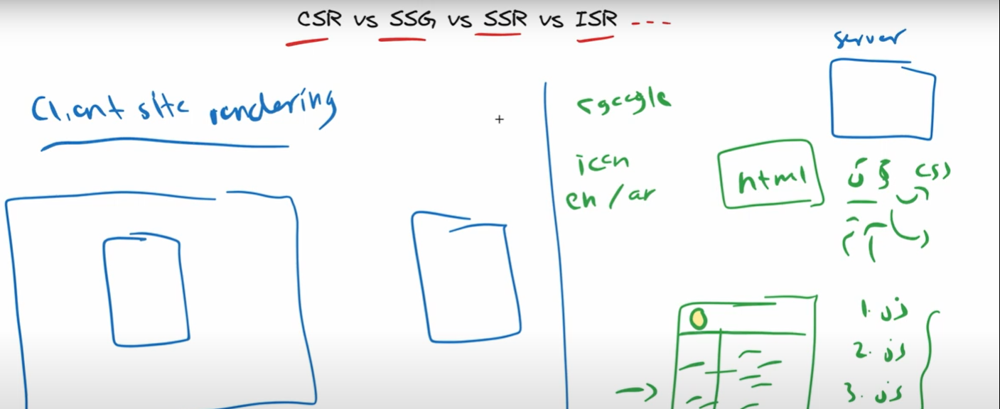
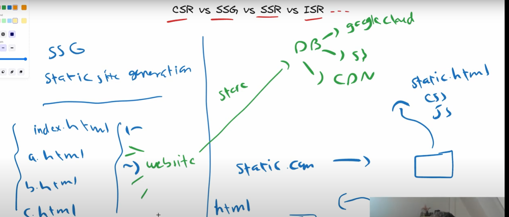
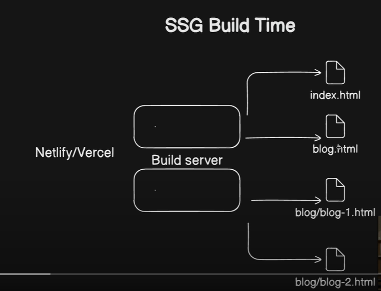
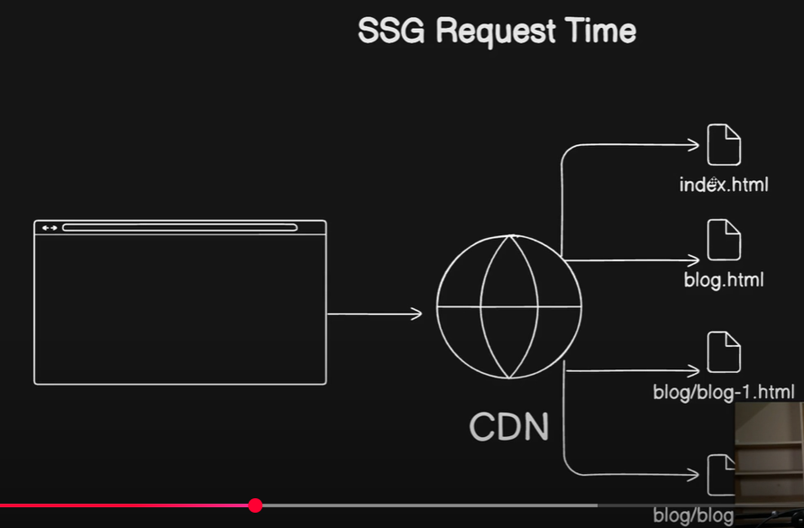
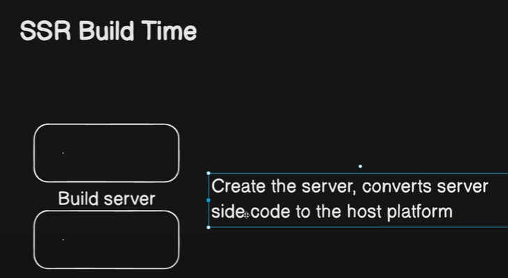
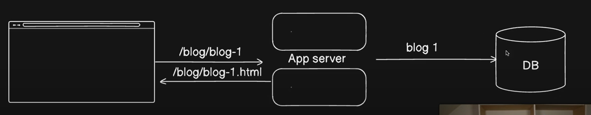
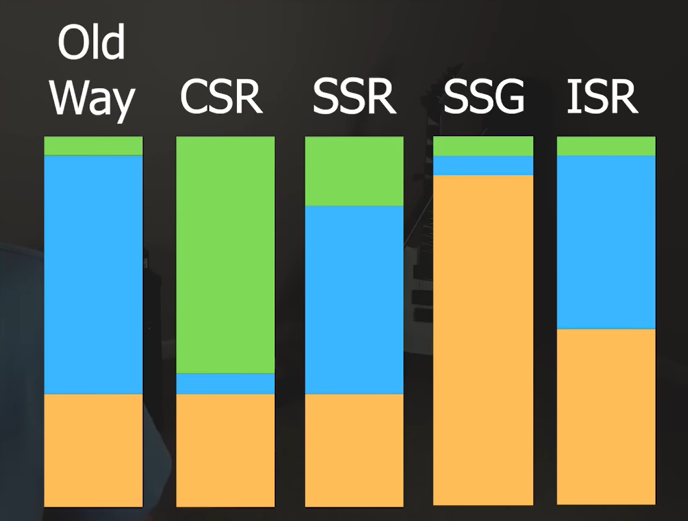

# Rendering

Build time -> Every time you push to Vercel you build, executed on the server

Request time -> When the user navigates to the website on the browser and the request sent to the server

|SSG|SSR|
|---|---|
| build: outcome is exclusively static files |  |
| request: CDN servers the static files | |

## 1. SSG (Static Site Generation)

### How it works

- Pages are pre-rendered at build time into static HTML.
- The server just serves static files (HTML + JS + CSS).
- Example: A blog site built with Next.js, Gatsby, Hugo, etc.

### Best use cases

- Content that doesn’t change often (blogs, marketing pages, docs).
- Sites where speed and SEO are critical.

### Pros

- Super fast (pre-rendered static HTML).
- Great for SEO (HTML is ready at load).
- Cheap to host (CDN-friendly).
- Very reliable (no server needed for rendering).

### Cons

- Content updates require rebuild/deploy.
- Large sites = long build times.
- Not ideal for highly dynamic data (e.g., dashboards).

### Tech examples

- Next.js (getStaticProps, getStaticPaths)
- Gatsby
- Hugo
- Jekyll

## 2. CSR (Client-Side Rendering)

### How CSR works

- The server serves a minimal HTML shell.
- JavaScript runs in the browser, fetching data via APIs and rendering UI.
- Example: React SPA, Angular, Vue (without SSR).

### Best use cases CSR

- Applications where SEO isn’t critical (internal tools, dashboards, SaaS apps).
- Highly interactive apps with lots of client state.

### Pros CSR

- Fast navigation after initial load (SPA feel).
- Great for interactive UIs.
- Easy to scale (server just serves static JS bundle).

### Cons CSR

- Poor initial load performance (JS must load before content appears).
- SEO issues (HTML is empty until JS runs — though Googlebot handles this somewhat).
- Slower Time-To-First-Byte (TTFB).

### Tech examples CSR

- React (CRA / Vite)
- Vue (Vite, Nuxt in SPA mode)
- Angular

## 3. SSR (Server-Side Rendering)

### How it works SSR

- HTML is generated on the server at request time.
- Client still hydrates with JavaScript to enable interactivity.
- Example: E-commerce product pages with frequently changing data.

### Best use cases SSR

- Dynamic content that needs SEO.
- Personalized pages (user dashboards, product listings).

### SSR Pros

- SEO-friendly (HTML delivered to crawlers immediately).
- Faster first paint than CSR.
- Content always fresh.

### SSR Cons

- Higher server costs (rendering happens on each request).
- Slower response if server is under load.
- Complexity: caching, load balancing required for scale.

### SSR Tech examples

- Next.js (getServerSideProps)
- Nuxt.js
- Angular Universal
- Remix

## 4. ISR (Incremental Static Regeneration)

### How ISR works

- Hybrid between SSG and SSR.
- Pages are pre-rendered like SSG, but can be regenerated in the background at runtime after a set interval (revalidate).
- Example: A news site that updates every 10 minutes.

### ISR Best use cases

- Sites with semi-frequent updates (blogs, e-commerce catalogs, news).
- Want SSG’s performance + near-fresh data without constant rebuilds.

### ISR Pros

- Fast like SSG (serves static HTML).
- Automatic background regeneration (no full rebuild).
- Scales well with CDN caching.

### ISR Cons

- Slightly stale content possible (until regeneration).
- More complex than pure SSG.
- Tied to frameworks that support ISR (not universal).

### ISR Tech examples

- Next.js (getStaticProps with revalidate)
- (Some frameworks are experimenting, but Next.js is main one)

### Quick Comparison Table

| Strategy | Rendering Time | SEO | Performance| Freshness| Best For|
|---|---|---|---|---|---|
|SSG|Build Time|Excellent|Fast|Stale if data changes|Blogs, docs, marketing sites|
|CSR|Client (browser)|Weak (unless pre-rendered)|Fast after load|Always fresh|Dashboards, internal apps|
|SSR|Request time (server)|Excellent|Slower|Always fresh|E-commerce, personalized apps|
|ISR|Build + background regen|Excellent|Fast|Semi-fresh|News, catalogs, large sitesNews, catalogs, large sites|

👉 In short:

Use SSG for static, rarely changing content.

Use CSR for apps where interactivity > SEO.

Use SSR for dynamic content that needs SEO + freshness.

Use ISR when you want SSG performance but need periodic freshness.

----

### SSG & SSR

- Both happen “on the server” (at least from a developer’s perspective).
- Both produce fully rendered HTML that can be sent to the browser (unlike CSR, which sends a mostly empty shell).
- But the key difference is when the rendering happens:
  - SSG → Rendered once at build time. Every user gets the same static HTML until you rebuild (or regenerate with ISR).
  - SSR → Rendered on every request. The server builds the HTML dynamically for each user (and can personalize it).

