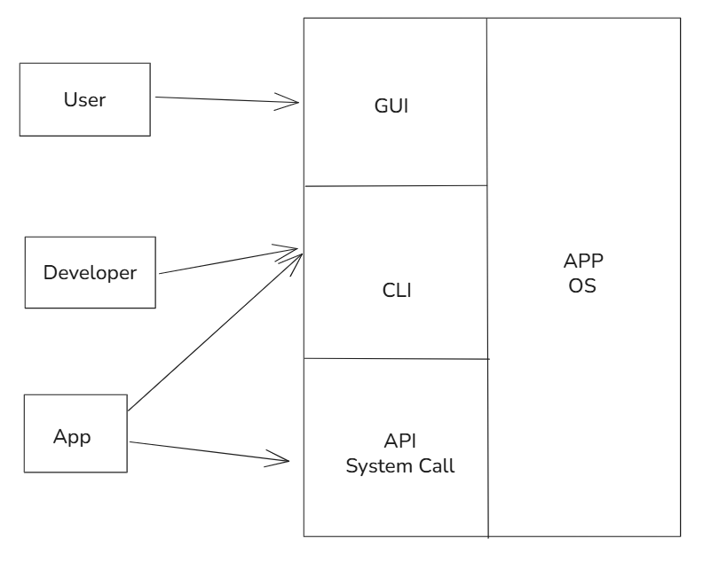
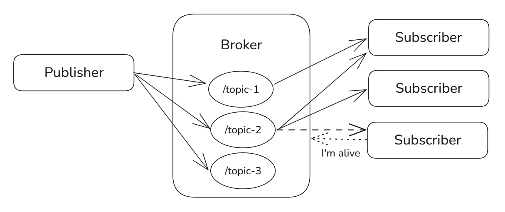
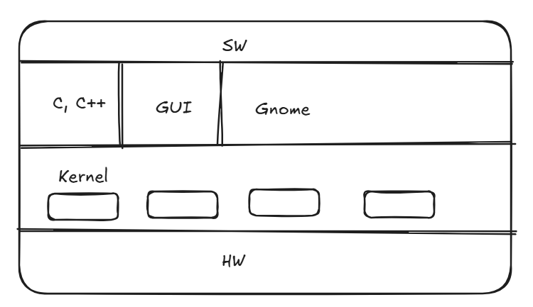

# OS Day 1 - OS Basics
## Tightly coupled system VS Loosely coupled system

loosely coupled system = distributed system

---

## Network

Client is anything that requests anything from the server: browser/app/prog lang
Most common servers: web server (Apache, Nginx, ... receives HTTP requests)
REST API is an intermediary

### Protocols

- Web pages -> HTTP/HTTPS
- MongoDB   -> Mongodb

### Connection Types on OS

- User          -> GUI + App + OS
- Developer     -> CLI + App + OS
- Application   -> API + App + OS (System Call)

API + Internet = web service
All web service is API, not all API is web service
System call is an API that OS created for an app to access the HW

### Webservice Types

- REST API
- GraphQL
- SOAP
- gRPC
- mqtt?

### Bi-directional Communication

#### Websocket

bi-directional communication between client and server... it is a layer added to an API

software added on API
Developer writes and handles the websocket
Heavy and always opened

#### PubSub

Mqtt

- Topic         -> A topic that can be subscribed to or published to
- Data          -> The content that gets shared
- Publisher     -> The client that sends the data
- Subscriber    -> The client that receives the data
- Broker        -> The "server" that connects the received data to the subscribed client on a topic

frequently asks if user is connected or not. Whenever reconnected data gets sent

Webhook is a concept used for notifications

---

## Clustered vs Distributed

Clustered devices are joining in storage

