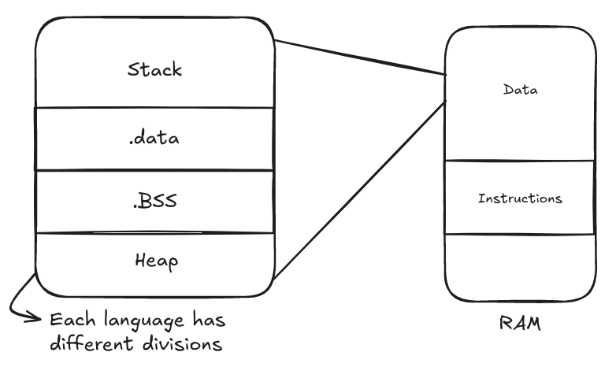

# OS Day 3 - Processes

A process/job is a running app on the CPU
Not all apps on RAM are running apps
Program = App on Hard disk
Process is a program in execution
C gets data from RAM
Use assembly in C to either optimize or access data that is not in the memory

We never know exactly how much time the process will take

Before switching apps should store all registers and returning them when going back to first app, as if it stayed there all the time.

## Process

PCB (Process Control Block) - A block stored in memory in OS
Stores infomration associated with each process:
    - Pointer
    - Process state
    - Process number
    - Program counter
    - CPU registers
    - CPU scheduling information
    - Memory-management information
    - Accounting information
    - I/O status information
The smaller the PCB the better because in context switching the CPU is idle and reading/writing in memory
PCB size affects the context switching duration

### Process States

## ...
Multi Programming systems leave if IO or terminated
Time sharing systems leave if IO or terminated or time slot ended

Multi Programming cpu utilization
Time sharing responsiveness

Throughput = how many tasks done / specific time

## Process Scheduling Queues

1. Job Queue
2. Ready Queue
3. Device Queues

## Scheduling

### Short Term Scheduler (CPU scheduler)

ready to running

### Mid Term Scheduler

takes part of hard disk, call it swap area/virtual memory
Virtual memory makes it slower but allows more data (more apps can be ran)

### Long Term Scheduler (Job scheduler)

