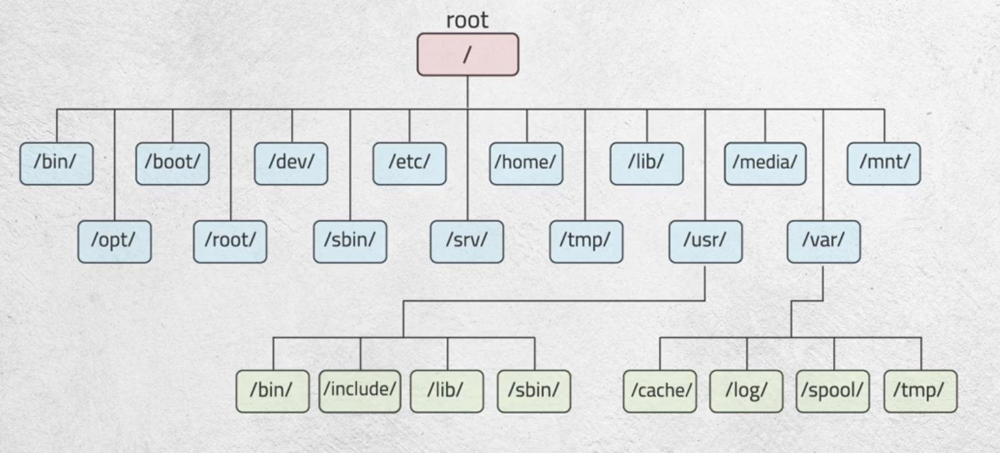

# Redhat Day 1 - Introduction

FOSS: Free Open Source Software - can view code, make and distribute modifications

## Linux Components

- Kernel
    - The core of the OS
    - Contains components like device drivers
    - Lods into RAM whne machine boots and stays till power off
- Shell
    - Provides interface to communicate with kernel
    - Bash is the most commonly used shell on Linux
    - Shells parse commands entered by user and translate the mto logical segments to be executed by the kernel or other utilities

Hardware communicates with Kernel
Kernel communicates with Shell
Shell communicates with User

Each version could have more than one release

## Linux Directories Tree

Linux interprets everything as files 
Linux doesn't need extensions

/
/bin/   -> binary files
/opt/   -> optional (3rd tool party apps)
/boot/  -> 
/root/  -> home directory for root user
/dev/   -> device partitions, etc... files
/sbin/  -> system binary files - only admin runnable, root configurable
/etc/   -> configuration files of the system - root configurable 
/srv/   ->
/home/  -> all home directories of all users - only directory user having full access to
/tmp/   -> temporary files - caching files, vscode builds - "in RAM", related to swap
/lib/   -> libraries of binary files
/usr    /bin/ , /include/ , /lib/ , /sbin/
        ubuntu and debian have symbolic links between usr/bin and /bin ...
/media/ -> any external device 
/var/   -> log files, anything varying, caches, spool (mails)
/mnt/   -> temporary mount file
/proc/  -> process related files

If an option takes an argument we cannot combine this option with other options

