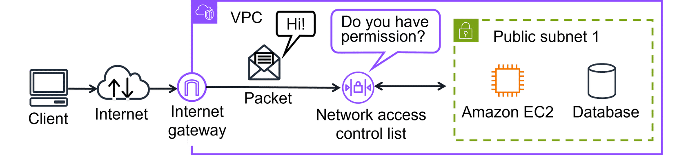

Describe what a virtual private cloud (VPC) is and what it does.

Describe what a subnet is and what it does.

Describe the difference between a public and private subnet.

Networking = interconnected devices that exchange data/resources.
Networking in AWS = infrastructure and services working together to host your applications, data, and any other resources you might need.

## Amazon Virtual Private Cloud (VPC)

Ana Amazon VPC lets you provision a logically isolated section of the AWS Cloud where you can launch AWS resources in a virtual network that you define.

## Subnet: a subsection of a VPN

Subnets are used to organize your resources and can be made publicly or privately accessible. A private subnet is commonly used to contain resources like a database storing customer or transactional information. A public subnet is commonly used for resources like a customer-facing website.

Subnets are essentially segments of your VPC, allowing you to divide your VPC into smaller, manageable sections. A subnet is a range of IP addresses in your VPC.

Private subnets are designed to isolate resources that shouldn't be directly exposed to the public internet. Public subnets are designed to provide direct internet access to resources placed inside them. To allow access, they are connected with an internet gateway.

## Internet Gateway

To allow public traffic from the internet to access your VPC, you attach an internet gateway to the VPC. An internet gateway is a connection between a VPC and the internet. You can think of an internet gateway as being similar to a doorway that customers use to enter the coffee shop. Without an internet gateway, no one can access the resources within your VPC.

> Amazon VPC is used to establish boundaries around you AWS resources

> Virtual private gateway allows protected internet traffic to enter into your VPC

> VPN encrypts your internet traffic, helping protect it from anyone who might try to intercept or monitor it.

## More ways to connect to the AWS Cloud

With so many different types of networks, on-premises datacenters, and remote workers, companies need a wide range of ways to connect to the AWS Cloud. Some methods:

- AWS Client VPN
- AWS Site-to-Site VPN
- AWS PrivateLink
- AWS Direct Connect
- AWS Transit Gateway
- Network Address Translation (NAT) Gateway
- Amazon API Gateway

### 1. AWS Client VPN - For Remote Workers
Think of it like a secure tunnel your employees use from home to access company resources on AWS.

- Works for individual remote workers connecting from anywhere
- Automatically grows or shrinks based on how many people are connecting
- No hardware needed — AWS manages everything

Example: A company acquires a new team in another country. Those new employees can securely access AWS resources from day one.

### 2. AWS Site-to-Site VPN – For Connecting Offices/Buildings
Instead of one person, this connects entire locations (like a whole office or data center) to AWS.

- Creates an encrypted "bridge" between your physical location and AWS
- Good for branch offices, factories, or data centers
- Used when migrating apps to the cloud or keeping secure links between locations

Example: A company's Cairo office needs a secure, permanent connection to their AWS setup.

### 3. AWS PrivateLink – For Private Service-to-Service Communication
This lets your AWS services talk to other services or VPCs privately, without going through the public internet at all.

- No need for gateways or complex setups
- You control exactly what can be accessed
- Keeps traffic secure and internal

Example: Your app in one VPC needs to talk to a service in another VPC — PrivateLink handles it privately and cleanly.

### 4. AWS Direct Connect – For High-Speed, Dedicated Connections
This is a physical, private cable running directly from your data center to AWS — not shared with anyone else.

- Much faster and more reliable than regular internet connections
- Lower latency (faster response times)
- Best for massive data transfers or businesses that need guaranteed bandwidth

Example: A company moving terabytes of data from their data center to AWS needs this dedicated line so the transfer is fast and reliable.

### Quick Comparison Table
|Service|Who/What Connects|Connection Type|Best For|
|-------|-----------------|---------------|--------|
|Client VPN|Individual remote workers|Encrypted tunnel|Remote workforce|
|Site-to-Site VPN|Entire offices/buildings|Encrypted tunnel|Branch offices|
|PrivateLink|Services/VPCs to each other|Private, internal|Service-to-service|
|Direct Connect|Data center to AWS|Physical dedicated line|Large data, high speed|

Bonus: Extra Gateway Types Mentioned

- Transit Gateway – Connects multiple VPCs and networks together like a hub
- NAT Gateway – Lets private resources access the internet without being exposed to it
- API Gateway – Manages and routes API calls to your services

## Security of Networking

> A Subnet of a VPC for grouping resources based on security or operational needs

When a customer requests data from an application hosted in the AWS Cloud, this request is sent as a packet. A packet is a unit of data sent over the internet or a network.

It enters into a VPC through an internet gateway. Before a packet can enter into a subnet or exit from a subnet, it will run into several checks for permissions, one being a network ACL associated with the subnet the packet is being routed to. The permissions defined by the network ACLs indicate what is allowed or denied. It is based on who sent the packet and how the packet is trying to communicate with the resources in a subnet.

The VPC component that checks packet permissions for subnets is a network ACL.

