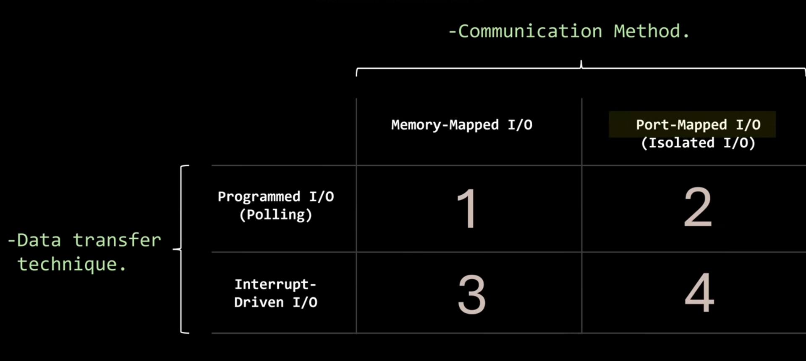
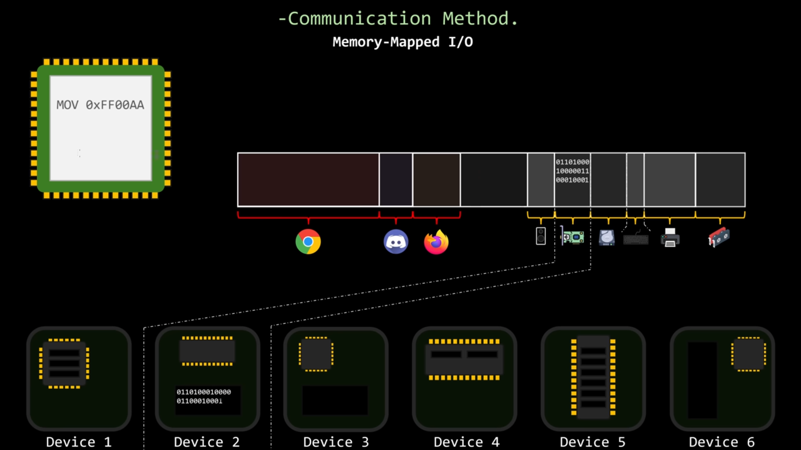

# Computer System Structure

Any computer system can be divided into 4 main components:
1. Hardware - provides basic computing resources
    > CPU, RAM, IO
2. Operating System - controls use of hardware among apps and users
3. Apps - define the ways that the users will use the system resources
    > Word, compilers, browser, db, games
4. Users
    > People, other computers, machines

## What is OS?

An OS is a program (SW) **managing the HW**, the intermediary between the user and the OS.

Users want convenience, ease of use and good performance
But shared computers must keep all users happy

**The kernel is the one program running at all times on the computer**

## I/O

### Memory-Mapped I/O

### Isolated I/O

Devices aren't mapped into memory at all, instead they are connected through a bus complettely separate from the memory bus
+ Memory and IO devices cannot interfere with each other -> makes system more parallel-friendly
- CPU now needs special instructions like in and out to talk to devices over this bus -> larger, more expensive chips, less power efficient

