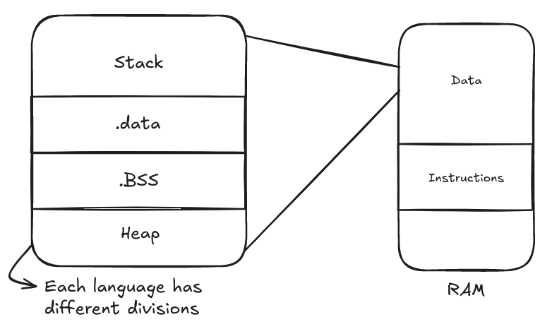
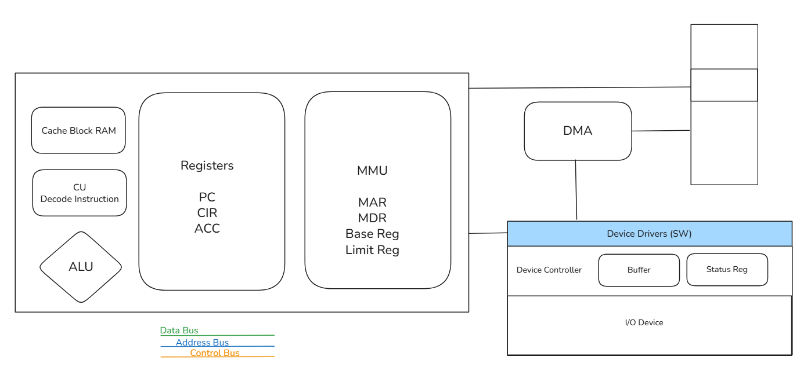

# Operating System Core Concepts and Computer Architecture

## Table of Contents
- [System Startup Process (Power On → OS Running)](#system-startup-process-power-on--os-running)
- [Kernel in CPU vs RAM](#kernel-in-cpu-vs-ram)
- [Polling vs Interrupts](#polling-vs-interrupts)
- [Interrupts and Interrupt Handling in OS](#interrupts-and-interrupt-handling-in-os)
- [Computer Architecture](#computer-architecture)

Bootstrap ≠ BIOS

## System Startup Process (Power On → OS Running)

1. **Power On**
   - When the user presses the power button, electrical power reaches the motherboard.
   - The CPU begins executing a fixed startup instruction from ROM.

2. **BIOS / UEFI Initialization**
   - BIOS is a firmware (readonly program) stored on the motherboard, designed by the hardware manufacturer.
   - Hardware-specific and may differ between models.
   - Initializes CPU, RAM, and connected devices.
   - Performs POST (Power-On Self-Test) to verify components like RAM, CPU, and disks.
   - If hardware is functional, locates a bootable device (HDD, SSD, USB, etc.) containing an operating system.

3. **Bootstrap Loader / Bootloader**
   - BIOS/UEFI loads the bootloader (e.g., GRUB) from disk or EFI partition.
   - The bootloader:
     - Displays a **menu of available operating systems or kernels** to boot.
     - Loads the selected operating system’s kernel from storage into RAM.
     - Transfers control to the kernel by setting the CPU instruction pointer to the kernel’s start address.

4. **OS Kernel Initialization**
   - The kernel is now in memory and begins execution.
   - It initializes hardware drivers, configures memory management, and starts essential system processes (e.g., `init` or `systemd`).

5. **User Space Setup**
   - The kernel launches essential background services (daemons).
   - The login screen, GUI, or shell appears.
   - Users can now run applications; each program receives controlled access to CPU, memory, and I/O through the OS.

| Aspect | **BIOS / UEFI** | **Bootloader** |
|--------|------------------|----------------|
| **Type** | Firmware (on motherboard) | Software program (on disk) |
| **Runs When** | Immediately after power-on | After BIOS/UEFI completes |
| **Main Job** | Test hardware, locate boot device | Load and start OS kernel |
| **Stored In** | ROM / Flash chip | MBR or EFI partition |
| **Code Size** | Small, fixed | Larger, configurable |
| **Examples** | AMI BIOS, Phoenix, UEFI firmware | GRUB, LILO, Windows Boot Manager |
| **Control Flow** | Power → BIOS/UEFI | BIOS/UEFI → Bootloader |

**Flow:**  
Power ON → BIOS/UEFI → POST → Find Boot Device → Bootloader (e.g., GRUB) → Show OS Menu → Load Selected Kernel → Kernel Initialization → User Space Setup → Applications Run

## Kernel in CPU vs RAM

- The **kernel** is the **core of the OS**, always **loaded in RAM** while the system is running.
- It must stay in RAM because it manages CPU scheduling, memory, I/O, and system resources.
- If the kernel were removed from memory, the system would immediately fail.

### Kernel and CPU Interaction
- The CPU executes **kernel code only when required**, not continuously.
- Most of the time, the CPU runs **user processes** (applications).
- When a user process needs privileged access (e.g., disk read, I/O), it makes a **system call**.
- The CPU then **switches to kernel mode**, executes the system call routine, and returns to user mode.

| Action | CPU Mode | Description |
|--------|-----------|-------------|
| **Enter Kernel** | Switches from user → kernel mode | Occurs during a system call, interrupt, or exception |
| **Leave Kernel** | Switches from kernel → user mode | After completing the operation, control returns to user process |

**Summary**
- Kernel is **always in RAM**.  
- CPU executes kernel code **on demand**, thousands of times per second.  
- This design prevents user programs from directly accessing hardware, ensuring protection and stability.  
- Two execution modes exist: **user mode (limited access)** and **kernel mode (privileged access)**.

## Polling vs Interrupts

### 1. Polling
- The CPU **repeatedly checks** a device to see if it needs service.
- Example: CPU continuously checks the keyboard buffer.
- Simple but wastes CPU time because it keeps checking even when no event occurs.

**Advantages:**
- Easy to design and debug.
- Suitable for constant or predictable data sources.

**Disadvantages:**
- Inefficient for multitasking systems.
- Consumes CPU cycles unnecessarily.

### 2. Interrupts
- The device **signals the CPU** only when it requires attention.
- CPU pauses current execution, runs the appropriate **Interrupt Service Routine (ISR)**, then resumes.
- Efficient in multitasking environments.

**Advantages:**
- Saves CPU time and energy.
- Ideal for asynchronous events.

**Disadvantages:**
- Context switching introduces small delay.
- Implementation is more complex.

| Feature | **Polling** | **Interrupts** |
|----------|--------------|----------------|
| Who initiates? | CPU | Device |
| CPU usage | Constant checking | Only when needed |
| Efficiency | Low | High |
| Complexity | Simple | More complex |
| Common Use | Simple/embedded systems | Modern multitasking systems |

## Interrupts and Interrupt Handling in OS

### What is an Interrupt
An **interrupt** is a signal sent to the CPU by hardware or software that **requests immediate attention**.  
It temporarily pauses current execution, handles the event, then resumes.

Purpose:
- Enables the CPU to respond quickly to asynchronous events (keyboard input, timer tick, I/O completion).

### What Happens During an Interrupt
1. A device or software sends an interrupt signal.
2. CPU stops current execution and **saves context** (registers, program counter) to RAM.
3. CPU switches to **kernel mode**.
4. CPU consults the **Interrupt Vector Table (IVT)** to locate the ISR.
5. Executes the corresponding **Interrupt Service Routine (ISR)**.
6. ISR performs minimal work, acknowledges the device, and updates status.
7. CPU restores saved state and resumes interrupted task.

### Interrupt Vector Table (IVT)
- A table in memory mapping **interrupt numbers** to their **ISR addresses**.
- Each hardware or software interrupt has a unique entry.
- Enables quick and deterministic ISR lookup.

| Interrupt No. | Device | ISR Address |
|----------------|---------|--------------|
| 0 | System Timer | 0x00000100 |
| 1 | Keyboard | 0x00000200 |
| 2 | Disk Controller | 0x00000300 |

### Interrupt Service Routine (ISR)
- A short kernel routine that handles an interrupt event.
- Runs in **kernel mode** with interrupts usually disabled to prevent nesting.
- Performs minimal work: acknowledges device, stores data, signals OS to process it later.

Example:  
Key pressed → Keyboard sends interrupt → ISR reads keycode → Stores in buffer for OS.

| Component | Role During Interrupt |
|------------|-----------------------|
| **CPU** | Saves current context, switches to kernel mode, executes ISR, restores context |
| **RAM** | Stores process states, stack frames, ISR code, and IVT |

### Types of Interrupts
| Type | Source | Example |
|------|---------|---------|
| **Hardware Interrupt** | From I/O devices | Keyboard, disk ready |
| **Software Interrupt** | From program or system call | `int 80h` in Linux |
| **Internal Interrupt (Exception)** | From CPU errors | Divide by zero, invalid memory access |

**Summary**
- Interrupt: signal that temporarily halts CPU execution.  
- ISR: function that services the interrupt.  
- IVT: table linking interrupts to ISRs.  
- CPU context is saved and restored automatically by hardware and kernel.  
- ISRs are short to maintain responsiveness and avoid blocking other interrupts.

## Computer Architecture

Computer Architecture defines the structure and interaction of the CPU, memory, and I/O subsystems.

### CPU Registers
Registers are small, fast storage inside the CPU used for temporary data, addresses, and control.
- **Program Counter (PC/IP):** Address of next instruction.
- **Instruction Register (IR):** Holds the current instruction.
- **Accumulator (ACC):** Stores ALU results.
- **Memory Address Register (MAR):** Holds memory address for access.
- **Memory Buffer/Data Register (MBR/MDR):** Temporarily holds data transferred to/from memory.
- **Status/Flags Register:** Holds condition flags (zero, sign, carry).

Registers are the CPU’s fastest storage — all data must pass through them before reaching RAM.

### Control Unit (CU)
The CU manages CPU operations. It:
1. Fetches instructions from memory using PC.
2. Decodes operation and operands.
3. Directs ALU, memory, and I/O to execute the instruction.
4. Updates PC to next instruction.

### Buses
- **Data Bus:** Transfers data between CPU, memory, and I/O (e.g., 64-bit bus moves 8 bytes per cycle).
- **Address Bus:** Carries memory addresses; width determines maximum addressable memory (32-bit → 4 GB, 64-bit → 16 EB theoretical).
- **Control Bus:** Carries signals like read/write, interrupt, and clock.

### Memory Hierarchy and Cache
Memory speed decreases as capacity increases.  
Hierarchy: **Registers → Cache → RAM → Secondary Storage**  
- **Cache Memory:** Small, fast memory near CPU storing frequently used data.
- **Cache Line (Block):** Small data unit exchanged between cache and RAM.
Cache reduces access time using spatial and temporal locality.

### Main Memory (RAM)
RAM stores active programs and data. Divided into:
- **Stack:** Function calls, local variables.
- **Heap:** Dynamic allocations.
- **Data Segment:** Global/static data.
- **Code Segment:** Program instructions.

RAM is volatile and cleared when power is off.

### Memory Management Unit (MMU)
The MMU translates **virtual addresses** to **physical addresses** using **page tables** managed by the OS.
Functions:
- Provides **virtual memory** (using disk for overflow).
- Enforces **memory protection** and isolation.

If a page is missing from RAM, MMU triggers a **page fault**, and the OS loads it from disk.

### Direct Memory Access (DMA)
DMA enables devices to transfer data directly between I/O and RAM without CPU involvement.
Steps:
1. CPU programs DMA with source, destination, and size.
2. DMA transfers data directly.
3. DMA signals CPU via interrupt when complete.

This increases throughput and reduces CPU load.

### I/O System and Device Controllers
Each I/O device has a **Device Controller**, which interacts with physical hardware.  
The OS communicates with controllers through **device drivers**.  
Controller components:
- **Data Register / Buffer:** Temporarily stores data.
- **Status Register:** Reports device readiness or errors.
- **Control Register:** Receives commands (start, stop, read, write).

I/O methods:
1. **Polling:** CPU repeatedly checks device status.
2. **Interrupts:** Device signals CPU when ready.
3. **DMA:** Device transfers data directly to memory.

### Summary of Flow
1. CPU executes instructions using registers.
2. CU coordinates data transfers through buses.
3. MMU translates addresses between virtual and physical memory.
4. Cache holds frequently accessed data.
5. RAM stores active code and data.
6. DMA and device controllers handle I/O efficiently with minimal CPU use.

The combined system ensures high performance, safety, and efficient communication between CPU, memory, and I/O.

