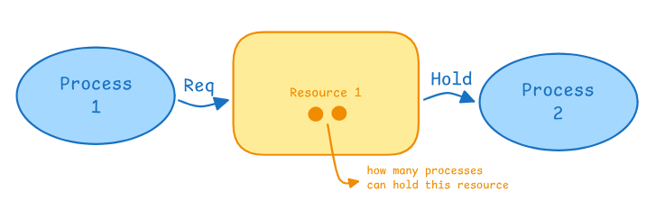

# **Process Management in Operating Systems**

## **Process Concept**
A **process** is a program in execution.  
It consists of:
- **Code (text segment)** — program instructions  
- **Data (heap, stack, globals)** — runtime data  
- **Program Counter (PC)** — next instruction address  
- **Registers and Resources** — CPU context, files, etc.  

Each process is represented in the OS by a **Process Control Block (PCB)** that stores its state, CPU registers, memory info, and scheduling data.

## **Process States**
A process moves through several states during execution:

| **State** | **Meaning** |
|------------|-------------|
| **New** | Process is being created |
| **Ready** | Waiting for CPU allocation |
| **Running** | Instructions are being executed |
| **Waiting / Blocked** | Waiting for I/O or event |
| **Terminated** | Execution finished |

The OS scheduler transitions processes between these states.

## **Context Switching**

When the CPU switches from one process to another:
1. The **current CPU state** (registers, PC, SP, flags) is **saved** into the current process’s **PCB** (in RAM).  
2. The **next process’s state** is **loaded** from its PCB.  
3. The CPU resumes execution of the new process.  

Context switching is handled by the **scheduler (dispatcher)** and happens during:
- Timer interrupts (time slice finished)
- I/O completion
- System calls causing blocking
- Higher priority process arrival  

Context switching is **pure overhead** — no useful work, just administrative.

CPU utilization achieved by multi-programming.
Responsiveness achieved by time-sharing.

## **CPU-Bound vs I/O-Bound Processes**

### **CPU-Bound Process**
- Spends most of its time using the **CPU** for computations.  
- Performs **heavy calculations**, data processing, or simulations.  
- Rarely waits for I/O.  
- Example: video rendering, scientific computation, compiling code.

### **I/O-Bound Process**
- Spends most of its time **waiting for I/O** operations (disk, network, user input).  
- CPU usage is low; most time is idle or blocked waiting for data.  
- Example: file transfer, web requests, user input programs.

### **System Performance Balance**
An efficient system should have a **good mix** of both types.

- If **too many CPU-bound processes** → CPU overloaded, I/O devices idle → poor response time.  
- If **too many I/O-bound processes** → CPU often idle, waiting for I/O → underutilized CPU.

**Best case:**  
> When CPU-bound and I/O-bound processes **overlap**, while one process waits for I/O, another uses the CPU.  
This keeps all resources (CPU + I/O) busy — maximizing throughput.

| **Type** | **Main Resource Used** | **CPU Usage** | **Wait Time** | **Example** |
|-----------|------------------------|----------------|----------------|--------------|
| **CPU-Bound** | Processor | High | Low | Compiler, Renderer |
| **I/O-Bound** | Disk, Network, Input | Low | High | Browser, File Copy |

**Goal:** Maintain a balance — mix CPU-bound and I/O-bound jobs so that **no resource stays idle**.

## **Operations on Processes**
- **Process Creation** — via system call (e.g., `fork()` in UNIX). Parent and child share some resources.  
- **Process Termination** — process finishes or is killed (`exit()`, `kill()`).  
- **Process Hierarchy** — parent–child relationships managed by the OS.

## **Threads**
A **thread** is a lightweight process — a unit of CPU execution within a process.  
Threads share:
- Same code and data segments  
- Open files and resources  
But each has:
- Its own program counter, stack, and registers  

Threads enable faster context switches and better resource sharing than processes.

## **Cooperating Processes**
Processes that can affect or be affected by others.  
They share data or coordinate actions.  
Benefits:
- Information sharing  
- Computation speedup  
- Modularity  
- Convenience  

## **Inter-Process Communication (IPC)**
Allows processes to communicate and synchronize.

### Methods:
1. **Shared Memory** — processes share a region of memory; fastest but needs synchronization.
2. **Message Passing** — processes exchange messages via the OS; slower but safer.

### Message Passing Operations:
- **send(destination, message)**
- **receive(source, message)**  

Can be **synchronous (blocking)** or **asynchronous (non-blocking)**.

### **Summary**
| Concept | Description |
|----------|-------------|
| **Process** | Program in execution with its own PCB |
| **Context Switch** | Save/load process state between PCBs |
| **Scheduler** | Chooses which process runs |
| **Thread** | Lightweight execution unit inside a process |
| **IPC** | Communication mechanism between processes |
| **Shared Memory vs Message Passing** | Fast but complex vs Safe but slower |

## **Operating System Structures**

### **1. Monolithic Kernel**
All OS services run in **kernel mode** as one large program.  
**Examples:** UNIX, Linux  
**+** Fast, direct function calls  
**–** Hard to maintain, one bug can crash the system  

### **2. Layered OS**
Divided into **layers**, each built on the lower one.  
**Examples:** THE, early Windows NT  
**+** Simple design and debugging  
**–** Slower (layer-to-layer communication)

### **3. Modular Kernel**
Core kernel with **loadable modules** (drivers, filesystems).  
**Examples:** Linux, macOS  
**+** Flexible, fast, maintainable  
**–** Still runs mostly in kernel mode (limited isolation)

### **4. Microkernel**
Only essentials in kernel; other services in **user space** via message passing.  
**Examples:** MINIX, QNX  
**+** Reliable, secure  
**–** Slower due to IPC overhead  

### **5. Microservices (Modern Cloud OS)**
System split into **independent services** communicating via APIs.  
**Examples:** Kubernetes, cloud OS  
**+** Scalable, fault-tolerant  
**–** High coordination and communication cost  

### **Summary**

| **Type** | **Core Idea** | **Example** | **Advantage** | **Disadvantage** |
|-----------|----------------|--------------|----------------|------------------|
| Monolithic | All in one kernel | Linux | Fast | Unstable if one fails |
| Layered | Hierarchical layers | Windows NT | Organized | Slower |
| Modular | Loadable modules | Linux, macOS | Flexible | Limited isolation |
| Microkernel | Minimal kernel + user services | MINIX, QNX | Secure | Slower IPC |
| Microservices | Independent services | Cloud OS | Scalable | Complex |

## **CPU Scheduling**

### **1. Preemptive vs Non-Preemptive Scheduling**

| **Type** | **Description** | **Example Algorithms** | **Advantages** | **Disadvantages** |
|-----------|----------------|------------------------|----------------|-------------------|
| **Preemptive** | The CPU can **take control** from a process before it finishes, to give it to another process. | Round Robin, SJF (Preemptive), Priority (Preemptive) | Responsive, good for multitasking | More overhead (context switching), complex |
| **Non-Preemptive** | Once a process starts running, it **keeps the CPU until it finishes** or waits (I/O). | FCFS, SJF (Non-Preemptive), Priority (Non-Preemptive) | Simple, no overhead | Can cause poor response time or starvation |

**Example:**  
- In **preemptive**, a short or high-priority process can interrupt a running one.  
- In **non-preemptive**, the running process must finish first.

### **2. Dispatcher**

The **Dispatcher** is the component that gives CPU control to the chosen process after the scheduler selects it.

**Main Functions:**
1. Performs **context switching** (save current, load next process state).  
2. Switches **CPU mode** from kernel to user.  
3. Jumps to the process’s program counter to start execution.

**Dispatch Latency:**  
Time taken by the dispatcher to stop one process and start another — it should be as small as possible.

**Summary:**
- **Scheduler** decides *who* runs next.  
- **Dispatcher** actually *runs it* (switches context and transfers control).

## **Process Scheduling**
The **CPU Scheduler** decides which process runs next.

### Types of Scheduling:
- **Long-term (Job Scheduler)** — selects which jobs enter ready queue.
- **Short-term (CPU scheduler)** — selects which ready process gets CPU.
- **Medium-term** — swaps processes in/out of memory.

### Scheduling Criteria:
- CPU utilization  
- Throughput  
- Turnaround time: total alive time of process since creation till ending 
- Waiting time: total time spent in waiting queue
- Response time: time till first response

### Common Algorithms:
- FCFS (First Come First Serve)
- SJF (Shortest Job First) - optimal but impossible because we don't know how long a process would take
- RR (Round Robin)
- Priority Scheduling
- Multilevel Queues

## **Deadlocks in Operating Systems**

### **1. Definition**
A **deadlock** occurs when two or more processes are **waiting for resources** held by each other, and **none can proceed**.  
It’s a state of **permanent blocking** unless external action is taken.

**Example:**
- Process A holds **Printer** and waits for **Disk**.  
- Process B holds **Disk** and waits for **Printer**.  
→ Both wait forever.
### **2. Necessary Conditions for Deadlock (Coffman Conditions)**
All **four** must hold simultaneously for a deadlock to occur:

| **Condition** | **Meaning** |
|----------------|-------------|
| **Mutual Exclusion** | At least one resource can’t be shared (only one process can use it at a time). |
| **Hold and Wait** | A process holding one resource is waiting for another. |
| **No Preemption** | Resources can’t be forcibly taken away. |
| **Circular Wait** | A circular chain of processes exists, each waiting for a resource held by the next. |
### **3. Deadlock Handling Methods**

| **Approach** | **Idea** | **Example / Notes** |
|---------------|----------|----------------------|
| **Deadlock Prevention** | Ensure at least one of the 4 conditions never holds. | Disallow hold-and-wait or circular wait. |
| **Deadlock Avoidance** | Dynamically check resource allocation using algorithms. | **Banker’s Algorithm** predicts if a state is safe. |
| **Deadlock Detection & Recovery** | Allow deadlocks, detect them later, and recover. | Periodically check resource graphs and terminate or preempt processes. |
| **Ignore** | Assume deadlocks are rare and do nothing. | Used in most systems (like UNIX, Windows). |
### **4. Resource Allocation Graph (RAG)**
- A directed graph showing **processes (P)** and **resources (R)**.  
- **Edge P → R**: Process requests resource.  
- **Edge R → P**: Resource assigned to process.  
- **Cycle in graph = possible deadlock** (definite only if each resource has one instance).
### **5. Deadlock Recovery Methods**
When detected:
- **Terminate Processes:** Kill one or more to break the cycle.  
- **Preempt Resources:** Temporarily take resources away from some processes.  
- **Rollback:** Restore processes to a safe checkpoint.
**Summary:**  
Deadlock = no process can proceed because each waits for another’s resource.  
Prevent, avoid, detect, or ignore — all depend on system design and performance needs.

