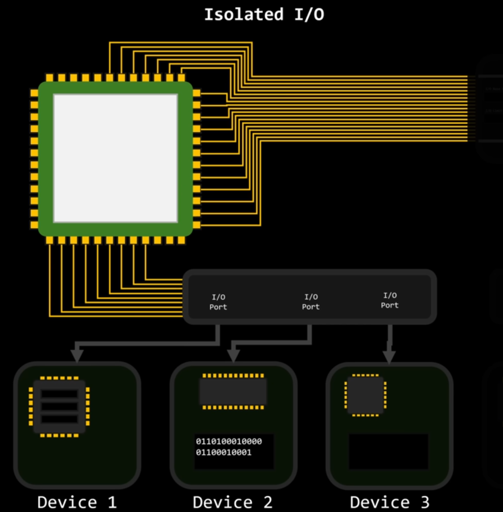

# I/O Management

## I/O hardware and device controllers

## Interrupts and DMA (Direct Memory Access)

## Device drivers

## I/O scheduling

## Buffering, Spooling, Caching

---
• Each device controller is in charge of a particular device type.
• Each device controller has a local buffer
• CPU moves data from/to main memory to/from local buffers
• Device controller informs CPU that it has finished its operation by causing an interrupt.
--- 

### Memory-Mapped I/O

### Isolated I/O

Devices aren't mapped into memory at all, instead they are connected through a bus complettely separate from the memory bus
+ Memory and IO devices cannot interfere with each other -> makes system more parallel-friendly
- CPU now needs special instructions like in and out to talk to devices over this bus -> larger, more expensive chips, less power efficient

