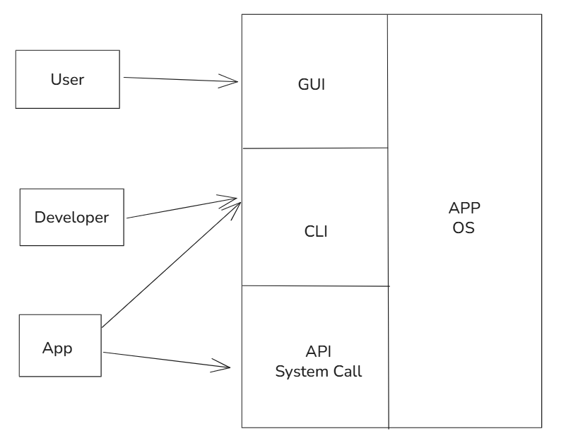
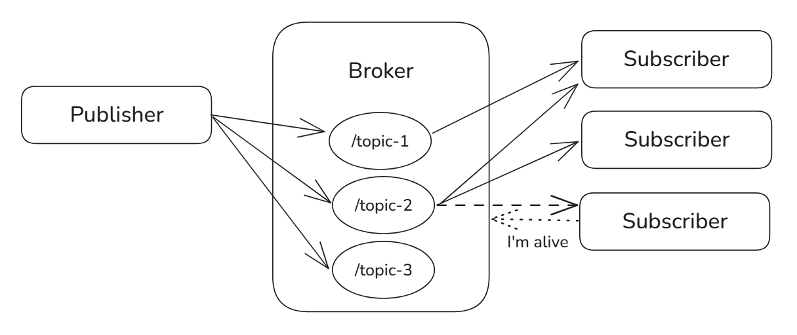
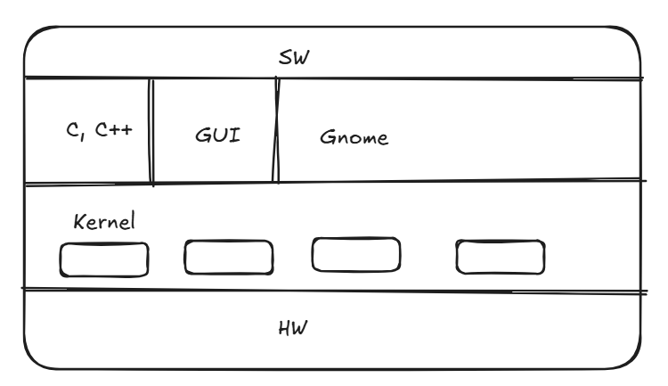

# OS Basics

A system is a combination of components each having specific function

Assembly is HW dependent
C is IO and OS dependent

Microprocessor: CPU and several supporting chips
Microcontroller: CPU on a single chip

OS job is to be an abstraction layer between HW and SW; we download apps depending on OS not CPU
SW depends on OS not HW

Computing Systems:
    - Embedded/Mobile: small hardware designed for a specific task (e.g., AC, TV, Microwave, etc...). It has limited resources.
    - General Purpose: any system that can connect to any IO and can do any task

RTOS (Real-Time Operating System):
    - Hard; time is critical
    - Soft; time sensitivity is not critical, just for convenience
TDE (Time Driven Event)
RTOS should have more idle time

Yocto project is a Linux Foundation open source project to create Linux distros for embedded and IoT SW, independent of architecture and HW

Von Neumann architecture: CPU + Memory + IO

---

Build process: code.c -> toolchain -> .exe (machine language)
Not all machine language is executable
Java -> compiler -> Bytecode (machine language - runnable on any OS with JVM)
SW -> JVM -> OS -> HW

JDK (Java Development Kit) vs JRE (Java RunTime Environment)
JDK(JRE(JVM), compiler)
to run java app only needed JRE
to dev java app needed JDK

Dynamic linking (missing ddl library), when app is run it is linked with the library on runtime, not static linking like C where the run code has the libraries available. Trade-off between speed and space. Interpreter and Compiler.

Java is fully compiled and fully interpreted
Python has multiple translators: pypy, cpython, jython, micropython, etc...
Java write once, run everywhere
NodeJS runtime environment

--- Memory ---

ROM is read-only memory for the CPU, but we can write as developers
Hard disk is IO not memory storage / or secondary storage.

OS reserves resources -> loads your app in RAM (instructions & data) -> then OS leaves
OS is loaded in RAM, but not always running

--- CPU ---

- Decode Circuit
- MMU (Memory Management Unit); doesn't let the developer utilize the physical addresses, we instead use virtual/logical. Only MMU and OS know the real addresses.
- Registers; program counter (el3aleh eldoor), CIR (current instruction register), ACC (accumulator), MAR (memory address register), MDR (memory data register)
- ALU

Fetch -> Decode -> Execute -> Store
Rust is the fastest language
node js, bun js
least interrupt is more important than biggest task

---

Kernel - the one program running at all times
As long as the kernel is in the RAM, the OS Is running
To have any app running it must be both in RAM and CPU

User -> Person/App/Machine/Developer/End User

simple batch system (RAM)
RUST, C++ -> smart pointers
appointed time ended/process finished/went for IO process

Time sharing = each process takes a fixed amount of time then the next process takes the same fixed amount of time.
App in cpu called process or job

---

## Tightly coupled system VS Loosely coupled system

loosely coupled system = distributed system

---

## Network

Client is anything that requests anything from the server: browser/app/prog lang
Most common servers: web server (Apache, Nginx, ... receives HTTP requests)
REST API is an intermediary

### Protocols

- Web pages -> HTTP/HTTPS
- MongoDB   -> Mongodb

### Connection Types on OS

- User          -> GUI + App + OS
- Developer     -> CLI + App + OS
- Application   -> API + App + OS (System Call)

API + Internet = web service
All web service is API, not all API is web service
System call is an API that OS created for an app to access the HW

### Webservice Types

- REST API
- GraphQL
- SOAP
- gRPC
- mqtt?

### Bi-directional Communication

#### Websocket

bi-directional communication between client and server... it is a layer added to an API

software added on API
Developer writes and handles the websocket
Heavy and always opened

#### PubSub

Mqtt

- Topic         -> A topic that can be subscribed to or published to
- Data          -> The content that gets shared
- Publisher     -> The client that sends the data
- Subscriber    -> The client that receives the data
- Broker        -> The "server" that connects the received data to the subscribed client on a topic

frequently asks if user is connected or not. Whenever reconnected data gets sent

Webhook is a concept used for notifications

---

## Clustered vs Distributed

Clustered devices are joining in storage

