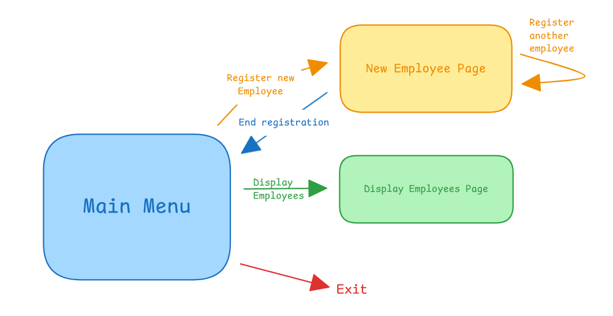

# Employees Registration App

## Description

- Portable on both Linux and Windows OS
- Terminal App with navigation, commands interpretation and usage of structs & pointers
- Add employees with their first & last names, salary, and DOB
- Validates input for each type and reprompt user if input is invalid

## Structure of the App

- [main.cpp](main.cpp)
    - contains the entry point to the app
    - builds the menu page of the app and controls the flow of the pages
    - builds the "register new employee" and "display employees" pages
- [terminal.h](terminal.h) & [terminal.cpp](terminal.cpp)
    - contain enum ``Key`` with values representing the used navigation keys
    - contain the functions that control the terminal: 
        - ``gotoxy(int x, int y)``
        - ``int getColorCode(const string &color)``
        - ``void changeColor(const string &textColor)``
        - ``void resetColor()``
        - ``void clearScreen()``
        - ``Key getKeyPress()``
- [employees.h](employees.h) & [employees.cpp](employees.cpp)
    - contain struct ``DOB`` consisting of 3 integer values, day, month, and year represeneting the date of birth of an employee.
    - contain struct ``Employee`` conisisting of first name, last name, salary, and DOB struct.
    - contain the functions used to assign input from user to an employee instance:
        - ``int getValidFirstName(Employee &e)``
        - ``int getValidLastName(Employee &e)``
        - ``int getValidSalary(Employee &e)``
        - ``int getValidDOB(Employee &e)``
- [helpers.h](helpers.h) & [helpers.cpp](helpers.cpp)
    - contain the helper functions that aid in validating user's input:
        - ``bool isInt(const string &input)``
        - ``bool isAlpha(const string &input)``
        - ``bool isValidDOB(const string &input)``
        - ``DOB extractDOB(string input)``

## Flow of the App



1. Main Menu Page:
    - The app initally opens on the main menu page with 3 options available to navigate through using the arrow keys.
    - The options available are New Employee, Display Employees, and Exit.
2. New Employee Page:
    - When the user chooses the New Employee page from the Menu Page, the user is prompted to enter the first name of the employee, followed by their last name, salary and DOB.
    - In each input the user's input is checked whether it is valid or not. If it is not valid the app displays an error message indicating the invalidation error and reprompts the user to enter another value. This process is repeated until the user supplies valid input.
    - If the user wants to quit entering at any time and return to the main menu, they can enter empty data while inputting any field.
    - After providing valid data for the first name, last name, salary, and DOB, the user will be displayed a message in green that the employee has been registered. The user can then proceed to register another employee, or return to the main menu.
3. Display Employees Page:
    - Displays a list of the employees registered in this terminal's session.
    - Each registered employee is printed in a line with their id, first name, last name, salary and DOB.
4. Exit:
    - If the user navigates to the exit option and chooses it or clicks ESC button in the homepage the app exits.

## External Libraries Used:

- [iostream](https://cplusplus.com/reference/iostream/)
    - stands for Input/Output Stream
    - used to access the objects ``cin`` and ``cout``
- [cstdlib](https://cplusplus.com/reference/cstdlib/)
    - stands for C Standard Library
    - used to access the environment ``system`` to execute system commands (clear terminal in our case) 
- [windows](https://learn.microsoft.com/en-us/windows/win32/api/winbase/)
    - used to access Windows API to use its system calls and objects like ``HANDLE``, ``GetStdHandle()``, ``COORD``, ``SetConsoleCursorPosition()``, and ``SetConsoleTextAttribute()``
- [conio](https://code-reference.com/c/conio.h)
    - stands for Console Input/Output
    - used to access function ``_getch()`` to parse inputted keys in Windows
- [unistd](https://pubs.opengroup.org/onlinepubs/7908799/xsh/unistd.h.html)
    - stands for Unix Standard.
    - used for ```STDIN_FILENO``` constant
- [termios](https://pubs.opengroup.org/onlinepubs/7908799/xsh/termios.h.html)
    - stands for Terminal Input Output Settings
    - used for gaining access to the ``termios`` structure and its methods ```tcgetattr()``` & ```tcsetattr()``` as well as the flag ```c_lflag``` and the attribute ```TCSANOW```.