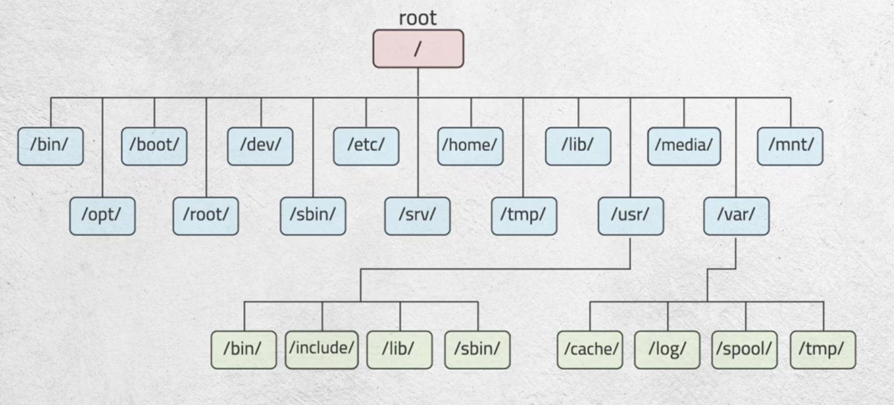

# Redhat System Administration I

## Table of Contents
- [Terminologies](#terminologies)
- [Linux Components](#linux-components)
- [Permissions](#permissions)
- [Users & Groups](#users--groups)
- [Vi Editor](#vi-editor)
- [Processes & Signals](#processes-priorities-and-signals-concepts)
- [Redirection, Pipelining, String Processing](#redirection-pipeline-string-processing)

## Terminologies

|Terminology|Description|
|---|---|
|**FOSS**|Free Open Source Software - can view code, make and distribute modifications|


## Linux Components

- Kernel
    - The core of the OS
    - Contains components like device drivers
    - Lods into RAM whne machine boots and stays till power off
- Shell
    - Provides interface to communicate with kernel
    - Bash is the most commonly used shell on Linux
    - Shells parse commands entered by user and translate the mto logical segments to be executed by the kernel or other utilities

Each version could have more than one release

- Hardware communicates with Kernel
- Kernel communicates with Shell
- Shell communicates with User


## Linux Directories Tree

- Linux interprets everything as files
- Linux doesn't need extensions

|Directory|Description|
|---|---|
|```/```  |root|
|```/bin/```| binary files|
|```/opt/```| optional (3rd tool party apps)|
|```/boot/```||
|```/root/```| home directory for root user|
|```/dev/```| device partitions, etc... files|
|```/sbin/```| system binary files - only admin runnable, root configurable|
|```/etc/```| configuration files of the system - root configurable|
|```/srv/```||
|```/home/```| all home directories of all users - only directory user having full access to|
|```/tmp/```| temporary files - caching files, vscode builds - "in RAM", related to swap|
|```/lib/```|libraries of binary files|
|```/usr/```|ubuntu and debian have symbolic links between usr/bin and /bin|
|```/media/```|any external device |
|```/var/```| log files, anything varying, caches, spool (mails)|
|```/mnt/```| temporary mount file|
|```/proc/```| process related files|

If an option takes an argument we cannot combine this option with other options



## Permissions

|Permission|File Access                     |Directory Access               |
|----------|--------------------------------|-------------------------------|
|Read      |Display file contents & copy    |Can list the directory content |
|Write     |Modify the file contents        |wx -> add and delete files     |
|Execute   |Execute/if shell and rx         |cd, rx -> ls -l                |

> to delete a file, no need for any permissions on the file, only wx on parent dir

```chmod permission filename```

Permissions specified in either:
- Symbolic mode:
    - Who
        - u: owner permissions
        - g: group permissions
        - o: other permissions
        - a: all   permissions
    - Operator
        - +: add    permissions
        - -: remove permissions
        - =: assign permissions
    - Permissions
        - r: read    permission
        - w: write   permission
        - x: execute permission
- Octal mode:
    - 4: read
    - 2: write
    - 1: execute

example: ```chmod u+x,go+r file1```, ```chmod a=rw file1```, ```chmod 555 file1```

## Users & Groups


```/etc/passwd``` 
username : password : userId : groupID : comment : homeDir : bash

```/etc/shadow```
username : password : lastChanged : min : max : warn : inactive : expire : futureUse

```bash
useradd -u userID -g groupID -c "Comment" -md /home/user -s fullPathOfShell userName
```

```passwd userName```

```bash
groupadd -g groupID groupName
```

```bash
usermod -g primaryGroup -aG secondaryGroup userName
```

```ls -la /etc/skel``` -> config files by default created for new users

```useradd -D```

```newusers filename```

```usermod -l newLoginName -L lockPassword -U unlockPassword```

```userdel -r username```

Change group of the files ```chgrp groupName fileNames``` -> ```chgrp os f1 f2 f3```

Temporarily change the primary group of user ```newgrp os``` -> ```exit```

Switch to another user with known commands ```su - user -c command options arguments; ...```

chown user1 file1

chown user1:group1 file1

chown :group1 file1

---

ls -l
Owner, Group, Others #ofLinks ownerName groupName sizeOfFile dateOfCreation nameOfFile

## VI Editor
> Default editor in all UNIX operating systems

### Commands

- h: left
- l: right
- j: down
- k: up
- i: insert before cursor
- I: insert from beginning of line
- a: insert after cursor
- A: insert at end of line
- x: delete cursor char
- X: backspace
- dd: delete line
- o: opens a new blank line below cursor
- O: opens a new blank line above cursor
- u: undo
- ctrl+r: redo
- w: forward one word
- b: back one word
- 0: go to beginning of line
- e: go to end of current word
- G: go to last line of file
- nG: go to line n
- ctrl+F: pages forward one screen
- ctrl+B: pages back one screen
- ctrl+L: refresh screen
- s: substitue a string for a character at the cursor
- dw: delete a word or part of word to right of cursor
- D: delete line from the cursor to right of cursor
- yy: copy
- dd: cut
- p: paste


- :w save file
- :wq save and exit
- :n goes to line n
- :set nu, :set nonu: show and hide line numbers
- :set ic, :setc noic: ignore or be case sensitive
- :set showmode, ;set noshowmode: display or turn off mode


```:%s/Linux/Unix/g```

```:1,3m7```

umask, alias & env vars are temporary (reset in new terminals)

man bash returns all shell variables

```env```, ```printenv``` show all env vars with values
```PS1, PS2, ...```

Environment in file -> user    environment
Environment in cli  -> session environment

alias c=clear
unalis c
\ls -> ignores alias "ls"

/home/user/.profile, /home/user/.bash_login, ...
/etc/.profile
/home/user.bashrc

## Processes, Priorities, and Signals Concepts
> Every running program creates a process. Eg, shell, command, application

> **Daemons** are processes running in background and provide services

### Process

-> Every process has a PID (process ID)

-> Waiting parent when child is done, parent is zombie process

-> Waiting child when parent is terminated, child is orphan process

-> Linux uses Round Robin + Priority

-> Niceness values range from **-20 to 19** (depending on distribution), **default is 0**

```bash
# Show all running in terminal
ps
PID         TTY      TIME       CMD
16946       pts/1    00:00:00   bash
16956       pts/1    00:00:00   ps

ps -l
F   S   UID     PID     PPID    C   PRI  NI ADDR SZ WCHAN  TTY          TIME CMD
0   S   1000    16946   16872   0   80   0 -  3475 do_wai pts/1    00:00:00 bash
0   R   1000    17035   16946   0   80   0 -  3824 -      pts/1    00:00:00 ps

ps -f
UID        PID      PPID    C   STIME   TTY      TIME       CMD
john       16946    16872   0   09:32   pts/1    00:00:00   bash
john       17287    16946   0   09:34   pts/1    00:00:00   ps -f

# Show all running processes on device
ps -e

# Show processes in a tree
pstree

# Run a process in background
gedit &
[jobID] processID


# Adjusting process priority at invocation time
nice [-n adjustment] command
nice -n 20 gedit

renice [adjustment -p processID]
renice 10 -p 3299
```

### Signals
> A signal is a message sent to a process to perform a certain action

- Signals are identified by a **signal number**, **signal name**, **associated action**

|Term|Description|
|-|-|
|Terminate|Closes if ready but not running|
|Kill|Kill signal - Forces closing even if running|
|Stop|Stops process|
|Cont|Continue signal if stopped|


```bash
# List jobs
jobs

# Send stop signal to job ID 1
kill -STOP %1

# Run process in foreground
fg [processID / %jobID]

# Run process in background
bg [processID / %jobID]

top

```

### Searching for a process

```bash
pgrep searchTerm # Return the id
pgrep -l searchTerm # Return the id and name
pgerp -lx searchTerm # Return the id and name of exact searchTerm
pgrep -lu username # Return the id and name of processes running on the user environment
```

- ctrl-Z stops fg process


## Redirection, Pipeline, String Processing

### Redirection

```bash
Command >  fname # output redirection
Command >> fname # output redirection (append)
Command <  fname # input redirection
Command 2> fname # error output redirection

#Examples:
$ find /etc -name passwd > findresult
$ ls -l /etc >> findresult
Mail < file1
```

File descriptor for each command:
- 0: standard input 0<
- 1: standard output 1>
- 2: standard error 2>

### Pipeline
> A pipe (|) is used to send the output of one command as the input to the other

```bash
# Tee command reads from std input and writes to std output and a file
$ ls -lR / | tee fname | more
```

### String Processing

```bash
cut -d: -f1,5,6 /etc/passwd

sort -k4 -t: -n /etc/passwd

grep bash$ /etc/passwd | cut -d: -f1
```

---

**Real User ID**: Represents the user who launched the process.
**Effective User ID**: Determines what the process is allowed to do.

## Compress & Archive

zip compatible with windows and linux
compress, uncompress, zcat -> .Z

- gzip        -> .gz
- bzip2       -> .bz
- compress    -> .Z
- zip         -> keeps old

tar cvf (create virtual file) ~/Desktop/PlaceToSaveTheTar.tar /folder /orFilesToSave
tar xvf (extract virtual file) ~/Desktop/PlaceOfTar.tar
tar tvf (display)
tar cjvf (or czvf)
-z uses gzip
-c create archvie
-j use bzip2
-

## Inode

Data structure containing metadata of a file

- owner
- size
- permission
- number of links
- last edited

ln -s /src /newSoft
ln /src /newHard

all soft links are created with 777 by default

soft bysm3 fl etnen

move doesnt create new inode

```sudo ln -s /usr/bin/python3 /usr/bin/bigboss```

---

rpm doesnt solve dependency issues unlike yum
